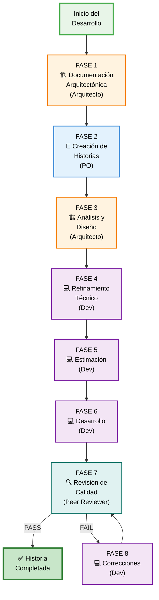

```mermaid
flowchart TD
    %% Inicio
    START["🚨 Incidente<br/>Reportado"]
    
    %% Paso 1
    RECIBIR["PASO 1<br/>📝 Recibir Error<br/>(PO)"]
    
    %% Decisión de prioridad
    DECISION{"Prioridad?"}
    
    %% Rama A: P0-P1 (Crítico)
    DIAG_A["PASO 2A<br/>🏗️ Diagnosticar<br/>(Arquitecto)"]
    REF_A["PASO 3A<br/>💻 Refinamiento<br/>(Dev)"]
    DEV_A["PASO 4A<br/>💻 Desarrollo<br/>(Dev)"]
    QA_A["PASO 5A<br/>🔍 Revisión<br/>(Peer Reviewer)"]
    POST_A["PASO 6A<br/>🏗️ Post-Mortem<br/>(Arquitecto)"]
    
    %% Rama B: P2-P4 (No crítico)
    DIAG_B["PASO 2B<br/>🏗️ Diagnosticar<br/>(Arquitecto)"]
    ANAL_B["PASO 3B<br/>🏗️ Análisis/Diseño<br/>(Arquitecto)<br/>OPCIONAL"]
    REF_B["PASO 4B<br/>💻 Refinamiento<br/>(Dev)"]
    EST_B["PASO 5B<br/>💻 Estimación<br/>(Dev)<br/>OPCIONAL"]
    DEV_B["PASO 6B<br/>💻 Desarrollo<br/>(Dev)"]
    QA_B["PASO 7B<br/>🔍 Revisión<br/>(Peer Reviewer)"]
    POST_B["PASO 8B<br/>🏗️ Post-Mortem<br/>(Arquitecto)"]
    
    %% Fin
    END["✅ Resuelto y<br/>Documentado"]
    
    %% Flujo Principal
    START --> RECIBIR
    RECIBIR --> DECISION
    
    %% Rama A: P0-P1
    DECISION -->|"P0-P1<br/>(Crítico)"| DIAG_A
    DIAG_A --> REF_A
    REF_A --> DEV_A
    DEV_A --> QA_A
    QA_A -->|FAIL| DEV_A
    QA_A -->|PASS| POST_A
    POST_A --> END
    
    %% Rama B: P2-P4
    DECISION -->|"P2-P4<br/>(No Crítico)"| DIAG_B
    DIAG_B --> ANAL_B
    ANAL_B --> REF_B
    REF_B --> EST_B
    EST_B --> DEV_B
    DEV_B --> QA_B
    QA_B -->|FAIL| DEV_B
    QA_B -->|PASS| POST_B
    POST_B --> END
    
    %% Estilos
    style START fill:#ffebee,stroke:#c62828,stroke-width:3px,color:#000000
    style RECIBIR fill:#fff3e0,stroke:#ef6c00,stroke-width:2px,color:#000000
    style DECISION fill:#e3f2fd,stroke:#1565c0,stroke-width:2px,color:#000000
    
    %% Rama A (P0-P1) - Rosa
    style DIAG_A fill:#fce4ec,stroke:#c2185b,stroke-width:2px,color:#000000
    style REF_A fill:#fce4ec,stroke:#c2185b,stroke-width:2px,color:#000000
    style DEV_A fill:#fce4ec,stroke:#c2185b,stroke-width:2px,color:#000000
    style QA_A fill:#e0f2f1,stroke:#00695c,stroke-width:2px,color:#000000
    style POST_A fill:#f3e5f5,stroke:#7b1fa2,stroke-width:2px,color:#000000
    
    %% Rama B (P2-P4) - Verde
    style DIAG_B fill:#e8f5e9,stroke:#388e3c,stroke-width:2px,color:#000000
    style ANAL_B fill:#e8f5e9,stroke:#388e3c,stroke-width:2px,stroke-dasharray: 5 5,color:#000000
    style REF_B fill:#e8f5e9,stroke:#388e3c,stroke-width:2px,color:#000000
    style EST_B fill:#e8f5e9,stroke:#388e3c,stroke-width:2px,stroke-dasharray: 5 5,color:#000000
    style DEV_B fill:#e8f5e9,stroke:#388e3c,stroke-width:2px,color:#000000
    style QA_B fill:#e0f2f1,stroke:#00695c,stroke-width:2px,color:#000000
    style POST_B fill:#f3e5f5,stroke:#7b1fa2,stroke-width:2px,color:#000000
    
    style END fill:#c8e6c9,stroke:#2e7d32,stroke-width:3px,color:#000000
```

# Método Ceiba - Guía Completa

## 📑 Índice

- [¿Qué es el Método Ceiba?](#-qué-es-el-método-ceiba)
- [Beneficios y Características](#-beneficios-y-características)
- [Roles y Agentes](#-roles-y-agentes)
- [Flujos de Trabajo](#-flujos-de-trabajo)
  - [1. Flujo de Desarrollo de Software](#1-flujo-de-desarrollo-de-software)
  - [2. Flujo de Migraciones](#2-flujo-de-migraciones)
  - [3. Flujo de Soporte y Gestión de Incidentes](#3-flujo-de-soporte-y-gestión-de-incidentes)
- [Instalación y Configuración](#-instalación-y-configuración)
- [Guía de Inicio Rápido](#-guía-de-inicio-rápido)
- [Estructura de Archivos](#-estructura-de-archivos)
- [Comandos Disponibles por Agente](#-comandos-disponibles-por-agente)

---

## 🌳 ¿Qué es el Método Ceiba?

El **Método Ceiba** es un framework estructurado de desarrollo de software que integra agentes impulsados por IA para acelerar y optimizar el ciclo completo de desarrollo. Su nombre hace referencia al árbol Ceiba, símbolo de fortaleza y conexión, representando la integración robusta entre personas, procesos y tecnología.

### Objetivo Principal

Proporcionar un enfoque sistemático que:

- ✅ **Acelera la entrega** manteniendo calidad consistente
- ✅ **Reutiliza conocimiento** mediante documentación viva que evoluciona con el código
- ✅ **Guía a todos los roles** con flujos claros y automatizados
- ✅ **Mantiene trazabilidad** completa desde requisitos hasta código
- ✅ **Reduce retrabajos** usando contexto arquitectónico en cada decisión

### Concepto de "Documentación Viva"

El Método Ceiba implementa un **GPS Arquitectónico** (Mapa de Arquitectura) que:

- Se actualiza automáticamente con cada cambio
- Conecta decisiones arquitectónicas con código fuente
- Sirve como fuente única de verdad del sistema
- Facilita onboarding de nuevos integrantes
- Permite consultas inteligentes sobre el sistema


## 🎯 Beneficios y Características

### ⚡ Eficiencia y Velocidad

| Beneficio | Descripción |
|-----------|-------------|
| **Velocidad con contexto** | Cada acción consume documentación y código existentes, evitando redacción duplicada |
| **Onboarding acelerado** | Nuevo talento entiende el sistema mediante el GPS Arquitectónico y historias enriquecidas |
| **Reducción de tiempos** | Documentación clara y estructurada disminuye curva de aprendizaje |

### 📚 Documentación Viva e Integración

| Característica | Valor |
|----------------|-------|
| **GPS arquitectónico** | Se actualiza con cada desarrollo, manteniendo coherencia |
| **Trazabilidad completa** | Historias conectadas a componentes, flujos y decisiones arquitectónicas |
| **Estándares específicos** | Basados en análisis real del código del proyecto |
| **Coherencia garantizada** | Historias fundamentadas en documentación arquitectónica existente |

### 🛡️ Calidad y Gestión Estructurada

| Aspecto | Implementación |
|---------|----------------|
| **Calidad continua** | Revisión estructurada con estándares derivados del proyecto |
| **Reducción de riesgo** | Análisis y diseño explícitos antes de codificar |
| **Revisión obligatoria** | Gates de calidad definidos y peer review sistemático |
| **Estimación fundamentada** | Basada en análisis de riesgos y complejidad técnica |

### 🔄 Aprendizaje y Mejora Continua

- **Aprendizaje organizacional**: Documentación viva evoluciona con cada entrega
- **Patrones reutilizables**: Arquitectura capturada acelera desarrollos futuros
- **Procesos transparentes**: Retroalimentación continua entre roles
- **Mejora iterativa**: Cada ciclo refina prácticas y conocimiento

---

## 👥 Roles y Agentes

El Método Ceiba define 4 agentes especializados que corresponden a roles técnicos dentro del equipo:

### 🏗️ Arquitecto (Architect)

**Icono**: 🏗️  
**Responsabilidades**:
- Documentar arquitectura base y componentes
- Analizar y diseñar historias de usuario complejas
- Documentar flujos de negocio críticos
- Generar estándares de código específicos del proyecto
- Explorar y analizar el proyecto en profundidad
- Diagnosticar incidentes críticos
- Administrar DoD y Pivotes Técnicos para estimación

**Roles de la empresa que lo usan**: Coach técnico, Líder técnico, Arquitecto de software

**Principios**:
- Pensamiento holístico de sistemas
- La experiencia de usuario impulsa la arquitectura
- Selección pragmática de tecnología
- Complejidad progresiva
- Seguridad en cada capa

### 📝 Product Owner (PO)

**Icono**: 📝  
**Responsabilidades**:
- Crear y gestionar historias de usuario
- Definir criterios de aceptación funcionales
- Priorizar backlog
- Recibir y clasificar errores e incidentes
- Gestionar dashboard de incidentes

**Roles de la empresa que lo usan**: Gerentes de proyecto, Product Managers, Analistas funcionales

**Principios**:
- Investigador meticuloso de contexto
- Elicitación estratégica mediante preguntas precisas
- Cazador de ambigüedades
- Garantía de completitud exhaustiva
- Adherencia rigurosa a templates y estándares

### 💻 Desarrollador (Developer)

**Icono**: 💻  
**Responsabilidades**:
- Refinar historias de usuario con contexto técnico
- Estimar esfuerzo de desarrollo
- Implementar funcionalidades
- Ejecutar pruebas completas
- Aplicar correcciones post-revisión

**Roles de la empresa que lo usan**: Desarrolladores Full-Stack, Front-end, Back-end

**Principios**:
- La historia es la fuente única de verdad
- Verificación del contexto antes de crear estructuras nuevas
- Flujo human-in-the-loop estricto
- Testing sin excepciones antes de completar tareas

### 🔍 Peer Reviewer

**Icono**: 🔍  
**Responsabilidades**:
- Revisar código implementado
- Validar calidad, seguridad y arquitectura
- Verificar cumplimiento de criterios de aceptación
- Aprobar o solicitar correcciones
- Garantizar adherencia a estándares

**Roles de la empresa que lo usan**: Desarrolladores Senior, Tech Leads

**Principios**:
- Seguridad primero
- Calidad sin compromiso
- Tests que realmente testean
- Arquitectura como contrato
- Feedback accionable

---

## 🔄 Flujos de Trabajo

El Método Ceiba proporciona tres flujos principales especializados:

### 1. Flujo de Desarrollo de Software

Este flujo cubre el ciclo completo desde la concepción de una funcionalidad hasta su entrega en producción.

#### 📊 Diagrama del Flujo



**Leyenda**:
- 🟢 Verde: Inicio del flujo
- 🟠 Naranja: Tareas del Arquitecto
- 🔵 Azul: Tareas del Product Owner
- 🟣 Morado: Tareas del Desarrollador
- 🔵 Turquesa: Revisión de Peer Reviewer
- 🟢 Verde oscuro: Historia completada

#### 🔢 Fases del Flujo de Desarrollo

##### **FASE 1: Documentación Arquitectónica** 🏗️

**Agente**: Arquitecto

| Paso | Comando | Propósito | Entregable |
|------|---------|-----------|------------|
| 1.1 | `architect *documentar-arquitectura-base` | Crear documentación base de arquitectura para proyectos complejos | `docs/architecture/index.md` |
| 1.2 | `architect *documentar-componente` | Documentar componentes individuales con detalle técnico | `docs/architecture/architecture-{componente}.md` |
| 1.3 | `architect *documentar-flujo-negocio` | Documentar flujos críticos con diagramas de secuencia | `docs/architecture/flujo-{nombre}.md` |
| 1.4 | `architect *generar-estandares-codigo` | Crear estándares específicos basados en código existente | `docs/architecture/coding-standards.md` |
| 1.5 | `architect *administrar-pivotes-dod` | Configurar tiempos base para tareas manuales (DoD) y tareas técnicas (Pivotes) | `docs/architecture/dod-pivots.md` |

**Cuándo ejecutar**: Al inicio del proyecto o cuando no existe documentación actualizada

##### 📊 Archivo DoD y Pivotes Técnicos

El archivo `dod-pivots.md` contiene dos tablas de tiempos preconfigurados:

| Tabla | Propósito | Uso |
|-------|-----------|-----|
| **Definition of Done (DoD)** | Tiempos de tareas manuales obligatorias (PR, deploys, pruebas manuales) | Usado en **Refinamiento** para generar Fase N |
| **Pivotes Técnicos** | Tiempos de tareas de código con Método Ceiba ya aplicado | Usado en **Estimación** como valor final |

Este archivo es **administrado por el Arquitecto** y **consumido automáticamente** por los workflows de Refinamiento y Estimación.

##### **FASE 2: Creación de Historias** 📝

**Agente**: Product Owner

| Paso | Comando | Propósito | Entregable |
|------|---------|-----------|------------|
| 2.1 | `po *escribir-historia` | Crear historias estructuradas con criterios de aceptación | `docs/stories/{número}.story.md` |

**Estado resultante**: `Borrador (PO)` - Lista para análisis arquitectónico

##### **FASE 3: Análisis y Diseño** 🏗️

**Agente**: Arquitecto

| Paso | Comando | Propósito | Entregable |
|------|---------|-----------|------------|
| 3.1 | `architect *analisis-y-diseno {número}` | Analizar arquitectura, tomar decisiones de diseño, proponer implementación | Historia actualizada con sección de análisis arquitectónico |

**Estado resultante**: `Analizado (Arquitecto)` - Lista para refinamiento técnico

**⚠️ Importante**: Requiere validación humana obligatoria de las decisiones arquitectónicas

##### **FASE 4: Refinamiento Técnico** 💻

**Agente**: Desarrollador

| Paso | Comando | Propósito | Entregable |
|------|---------|-----------|------------|
| 4.1 | `dev *refinamiento-tecnico {número}` | Enriquecer con contexto técnico y descomponer en tareas | Historia con descomposición técnica y tareas |

**Estado resultante**: `Refinado (Dev)` - Lista para estimación

**📌 Consumo de DoD**: Si existe archivo `dod-pivots.md`, las tareas manuales de Fase N se toman de la tabla DoD.

##### **FASE 5: Estimación** 💻

**Agente**: Desarrollador

| Paso | Comando | Propósito | Entregable |
|------|---------|-----------|------------|
| 5.1 | `dev *estimar-historia-usuario {número}` | Estimar basado en complejidad y riesgos | Historia con estimación en story points |

**Estado resultante**: `Estimado (Dev)` - Lista para desarrollo

**📌 Consumo de Pivotes**: Si existe archivo `dod-pivots.md`, las tareas de código usan tiempos de Pivotes Técnicos (ya incluyen Método Ceiba).

##### **FASE 6: Desarrollo** 💻

**Agente**: Desarrollador

| Paso | Comando | Propósito | Entregable |
|------|---------|-----------|------------|
| 6.1 | `dev *desarrollar-historia-usuario {número}` | Implementar funcionalidad con pruebas completas | Código + Tests + Historia actualizada |

**Estado resultante**: `Implementado (Dev)` - Listo para revisión

##### **FASE 7: Revisión de Calidad** 🔍

**Agente**: Peer Reviewer

| Paso | Comando | Propósito | Entregable |
|------|---------|-----------|------------|
| 7.1 | `peer-reviewer *revisar-historia {número}` | Revisar calidad, seguridad, arquitectura y estándares | Historia con QA Results + Gate de decisión |

**Posibles decisiones**:
- ✅ **PASS**: Cumple todos los criterios, aprobado
- ⚠️ **CONCERNS**: Tiene observaciones, puede continuar con seguimiento
- ❌ **FAIL**: Requiere correcciones obligatorias
- 🔄 **WAIVED**: Exenciones justificadas aprobadas

**Estado resultante**: `Revisado (QA)` - Según decisión del gate

##### **FASE 8: Correcciones Post-Revisión** 💻 (Iterativo)

**Agente**: Desarrollador

| Paso | Comando | Propósito | Entregable |
|------|---------|-----------|------------|
| 8.1 | `dev *desarrollar-historia-usuario {número}` | Implementar correcciones identificadas en revisión | Código corregido + Historia actualizada |

**Estado resultante**: `Corregido (Dev)` - Retorna a revisión

**🔄 Ciclo iterativo**: Revisión → Corrección → Re-revisión hasta obtener estado PASS

---

### 2. Flujo de Migraciones

#### 📋 Principios Generales de Migración

Es fundamental identificar desde la fase comercial la arquitectura TO-BE, los indicadores KPI de éxito del proceso de migración, drivers de arquitectura que se deben garantizar y así mismo los adicionales que se deben de ejecutar en esta migración como por ejemplo: migrar pruebas existentes, nuevas pruebas unitarias, resolver deuda técnica, garantizar un porcentaje de cobertura, nuevas pruebas de integración, nuevas pruebas de carga, nuevas pruebas funcionales automatizadas, nuevas pruebas de seguridad.

Recordar que migrar no necesariamente debe de tener los adicionales anteriores y deben ser claramente identificados y estimados en la fase de pivotes en caso de aplicar.

En caso de no aplicar adicionales tener presente que es perfectamente válido según el proceso de desarrollo de Ceiba no tener en estos casos sonar, quality gate y revisiones par con todo el proceso de calidad de la compañía. Es vital dejarlo claro desde la entrega comercial.

Tipicamente para estimar una migración se conforma un equipo con un gerente de proyectos, un arquitecto y un desarrollador por un periodo de tiempo de entre 7 a 15 días.

**Principios clave de migración:**

- **Plan de pruebas**: Definir estrategia de validación incremental por cada entregable, es decir debemos definir la forma para asegurar la calidad de cada entregable en el origen/destino y los data sets de pruebas para lograr esto, sino se tiene una estrategia clara de pruebas la migración será inviable.

  Algunos ejemplos: Hacer ingeniería inversa para sacar pruebas ejecutables en insomnia de los endpoint origen para ejecutarlos posteriormente en el destino, definir desde el inicio del proyecto si se debe detener un QA de parte del cliente/Ceiba para que certifique cada camino posible.

- **Despliegue incremental**: Establecer plan de releases graduales con validación en producción
- **Evitar Big Bang**: Siempre que sea posible, priorizar entregas incrementales sobre despliegues masivos
- **Rollback controlado**: Garantizar capacidad de reversión sin afectar el sistema completo

Las migraciones son procesos especiales que requieren enfoques adaptados según su naturaleza. El Método Ceiba distingue dos tipos:

#### 🔀 Tipo 1: Migración NO Pivotable

**Definición**: Migración donde NO es posible identificar pivotes claros de migración.

**Ejemplos comunes**:
- Actualizaciones de versiones de frameworks o lenguajes (Java 7 → 11)
- Desacoplamiento de librerías legadas
- Cambios tecnológicos sin ruta incremental clara (Spring Boot 2.0 → 3.0)
- Refactorizaciones masivas sin puntos intermedios

**Estimación**: Por juicio experto del equipo técnico,
recordar que antes de todo esto se debe tener acceso al código fuente y haber instalado el método ceiba.

##### Proceso Recomendado

| Fase | Agente | Comando | Actividad |
|------|--------|---------|-----------|
| **1. Exploración** | Arquitecto | `architect *explorar-proyecto` | Analizar código, identificar riesgos, evaluar alternativas, definir estrategia |
| **2. Documentación** | Arquitecto | `architect *documentar-arquitectura-base` | Generar `docs/architecture/index.md` |
| **3. Historias** | PO | `po *escribir-historia` | Crear historias de usuario técnicas |
| **4. Ejecución** | Todos | Flujo normal | Seguir fases 3-8 del Flujo de Desarrollo |

**Ejemplo de prompt para exploración**:

```
Necesito hacer una actualización tecnológica actualizando las versiones de 
Java de la versión 7 a la 11 y Spring Boot de 2.0 a 3.0.

Ayúdame a:
1. Hacer un análisis de impacto de dicha tarea
2. Proponer una estrategia concreta de migración
3. Identificar una secuencia de pasos para dividir en historias de usuario técnicas
4. Realiza un estimación justificada de horas de cuanto tiempo consideras que puede tomar 
esta labor usando agentes de inteligencia artificial.
5. Ayudame a identificar que tipos de pruebas 
tiene esta base de código fuente, 
si existe un pipeline de ci/cd,
la complejidad del código fuente en una escala 
de 0-10 y la cobertura de pruebas actual.

Documenta el análisis en: docs/architecture/migration/estrategia-migracion.md
```

#### 🎯 Tipo 2: Migración Pivotable

**Definición**: Migración donde ES posible identificar pivotes claros que permiten transformación incremental.

**Ejemplos de pivotes técnicos**:
- 🌐 **Endpoints REST/API**: Migración endpoint por endpoint
- 🖥️ **Vistas/Páginas**: Migración de interfaz vista por vista
- 🗄️ **Procedimientos almacenados**: Migración de lógica de BD
- ⏰ **Tareas programadas/Jobs**: Migración de procesos batch
- 📡 **Event handlers**: Migración de procesadores de eventos

**Casos de uso comunes**:
- Monolito → Microservicios
- Angular → React
- JSF → Angular
- .NET Framework → .NET Core

**Características clave**:
- ✅ Unidades identificables e independientes
- ✅ Migración incremental sin big bang
- ✅ Validación por pivote
- ✅ Rollback granular
- ✅ Coexistencia sistema legacy y nuevo

##### Proceso Recomendado

| Fase | Agente | Comando | Actividad | Entregable |
|------|--------|---------|-----------|------------|
| **1. Inventario** | Arquitecto | `architect *explorar-proyecto` | Catalogar todos los pivotes con clasificación | `docs/architecture/migration/pivotes-inventario.md` |
| **2. Arquitectura TO-BE** | Arquitecto | `architect *crear-arquitectura` | Documentar arquitectura objetivo | `docs/architecture/migration/arquitectura-to-be.md` |
| **3. Historias por pivote** | PO | `po *escribir-historia` | Crear historia por pivote o grupo de pivotes | Historia por cada pivote |
| **4. Ejecución** | Todos | Flujo normal | Seguir fases 3-8 del Flujo de Desarrollo por cada pivote | Pivotes migrados incrementalmente |
| **5. Estimación** | Arquitecto + Dev | Manual | Migrar 3 pivotes representativos (baja/media/alta complejidad) y medir tiempos | Estimación empírica del proyecto |

**Ejemplo de prompt para inventario**:

```
¿Qué es un pivote? Es un punto de entrada que sea una unidad funcional 
lo más independiente posible. Ejemplos: endpoint, tarea programada, vista, 
procedimiento almacenado.

Estoy migrando este sistema y necesito identificar y catalogar todos los 
pivotes con:
- Tipo de pivote
- Módulo
- Proceso de negocio
- Complejidad técnica (escala 1-5)
- Justificación de la complejidad
- Riesgos del pivote
- Análisis de dependencias entre pivotes

Genera un inventario completo en: docs/architecture/migration/pivotes-inventario.md
Prioriza según valor de negocio.

Adicionalmente ayudame a identificar que tipos 
de pruebas tiene esta base de código fuente, 
si existe un pipeline de ci/cd,
la complejidad del código fuente en una escala de 0-10 
y la cobertura de pruebas actual.
```

##### 📊 Estrategia de Estimación Empírica

**Paso 1**: Seleccionar pivotes representativos
- 1 pivote de complejidad 1 (baja)
- 1 pivote de complejidad 3 (media)
- 1 pivote de complejidad 5 (alta)

**Paso 2**: Migrar completamente cada pivote midiendo tiempo real de:
- Análisis y diseño
- Desarrollo e implementación
- Pruebas y validación (100% equivalencia con original)

**Paso 3**: Extrapolar al inventario total
- Multiplicar tiempo de cada nivel por cantidad de pivotes de ese nivel
- Sumar totales
- Aplicar factor de aprendizaje y mejora continua

#### 🆚 Comparación: Pivotable vs. No Pivotable

| Aspecto | Migración Pivotable | Migración No Pivotable |
|---------|---------------------|------------------------|
| **Granularidad** | Unidades funcionales claras | Sistema completo o módulos grandes |
| **Riesgo** | 🟢 Bajo - Incremental | 🔴 Alto - Big bang |
| **Rollback** | Por pivote individual | Todo o nada |
| **Validación** | Continua por pivote | Al final de la migración |
| **Coexistencia** | Legacy y nuevo en paralelo | Difícil mantener ambos |
| **Estimación** | Empírica con pivotes de referencia | Juicio experto |

---

### 3. Flujo de Soporte y Gestión de Incidentes

Este flujo gestiona el ciclo completo de atención a errores e incidentes en producción, desde la recepción hasta la resolución y documentación del conocimiento adquirido.

#### 📊 Diagrama del Flujo



**Leyenda**:
- 🔴 Rojo: Incidente reportado
- 🟠 Naranja: Clasificación inicial
- 🔵 Azul: Punto de decisión
- 🔴 Rosa: Flujo crítico P0-P1
- 🟢 Verde: Flujo normal P2-P4
- 🔵 Turquesa: Revisión de calidad
- 🟢 Verde lima: Gestión y monitoreo
- 🟢 Verde oscuro: Resolución exitosa

#### 🔢 Fases del Flujo de Soporte

##### **FASE 1: Recepción y Clasificación** 📝

**Agente**: Product Owner

| Paso | Comando | Propósito | Entregable |
|------|---------|-----------|------------|
| 1.1 | `po *recibir-error` | Recibir, clasificar y registrar incidente con prioridad | `docs/incidents/{fecha}-{slug}.incident.md` |

**Clasificación de prioridad**:
- **P0**: Sistema caído, impacto total, resolución inmediata
- **P1**: Funcionalidad crítica afectada, impacto alto
- **P2**: Funcionalidad importante con workaround, impacto medio
- **P3**: Funcionalidad menor afectada, impacto bajo
- **P4**: Mejora o issue cosmético, sin impacto funcional

**Estado resultante**: `Clasificado (PO)`

##### **Bifurcación según prioridad**

#### 🚨 Rama A: Incidentes Críticos (P0-P1)

##### **FASE 2A: Diagnóstico de Causa Raíz** 🏗️

**Agente**: Arquitecto

| Paso | Comando | Propósito | Entregable |
|------|---------|-----------|------------|
| 2A.1 | `architect *diagnosticar` | Aplicar metodología 5 Whys para identificar causa raíz | Incidente con sección de diagnóstico |

**Estado resultante**: `Diagnosticado (Arquitecto)`

##### **FASE 3A: Refinamiento Técnico** 💻

**Agente**: Desarrollador

| Paso | Comando | Propósito | Entregable |
|------|---------|-----------|------------|
| 3A.1 | `dev *refinamiento-tecnico {número}` | Refinar detalles técnicos de implementación urgente | Incidente con refinamiento técnico |

**Estado resultante**: `Refinado (Dev)`

**⚠️ Nota**: Para P0-P1 el refinamiento es rápido y enfocado, sin estimación formal.

##### **FASE 4A: Implementación de Fix** 💻

**Agente**: Desarrollador

| Paso | Comando | Propósito | Entregable |
|------|---------|-----------|------------|
| 4A.1 | `dev *desarrollar-historia-usuario {número}` | Implementar solución urgente con tests | Código + Tests + Incidente actualizado |

**Estado resultante**: `Resuelto (Dev)`

**⚠️ Nota**: Para P0-P1 NO se requiere estimación, pero SÍ revisión rápida de peer reviewer antes de despliegue.

##### **FASE 5A: Revisión de Calidad** 🔍

**Agente**: Peer Reviewer

| Paso | Comando | Propósito | Entregable |
|------|---------|-----------|------------|
| 5A.1 | `peer-reviewer *revisar-historia {número}` | Revisión rápida de calidad y no-regresión | Incidente con QA Results |

**Estado resultante**: `Revisado (QA)`

**⚠️ Nota**: Para P0-P1 la revisión es EXPEDITA enfocada en validar que el fix resuelve el problema sin introducir regresiones críticas. No bloquea despliegue urgente.

**🔄 Si FAIL**: Retorna a Fase 4A para correcciones

##### **FASE 6A: Post-Mortem y KB** 🏗️

**Agente**: Arquitecto

| Paso | Comando | Propósito | Entregable |
|------|---------|-----------|------------|
| 6A.1 | `architect *documentar-incidente` | Generar post-mortem y evaluar para Knowledge Base | Post-mortem + Índices por categoría y tags |

**Entregables**:
- `docs/kb/post-mortem/{fecha}-{slug}.md`
- `docs/kb/index-by-category.md` (actualizado)
- `docs/kb/index-by-tags.md` (actualizado)

**Estado resultante**: `Documentado (Arquitecto)` ✅

#### 🔧 Rama B: Incidentes No Críticos (P2-P4)

##### **FASE 2B: Diagnóstico de Causa Raíz** 🏗️

**Agente**: Arquitecto

| Paso | Comando | Propósito | Entregable |
|------|---------|-----------|------------|
| 2B.1 | `architect *diagnosticar` | Aplicar metodología 5 Whys para identificar causa raíz | Incidente con sección de diagnóstico |

**Estado resultante**: `Diagnosticado (Arquitecto)`

##### **FASE 3B: Análisis y Diseño** 🏗️ (OPCIONAL)

**Agente**: Arquitecto

| Paso | Comando | Propósito | Entregable |
|------|---------|-----------|------------|
| 3B.1 | `architect *analisis-y-diseno {número}` | Analizar arquitectura y diseñar solución (solo si requiere impacto arquitectónico) | Incidente con análisis arquitectónico |

**Estado resultante**: `Analizado (Arquitecto)`

**⚠️ Cuándo ejecutar**: Solo cuando el fix requiere cambios arquitectónicos significativos, impacto en múltiples componentes, o decisiones de diseño complejas. Para fixes simples, saltar directamente a refinamiento.

##### **FASE 4B: Refinamiento Técnico** 💻

**Agente**: Desarrollador

| Paso | Comando | Propósito | Entregable |
|------|---------|-----------|------------|
| 4B.1 | `dev *refinamiento-tecnico {número}` | Descomponer solución en tareas ejecutables | Incidente con refinamiento técnico |

**Estado resultante**: `Refinado (Dev)`

##### **FASE 5B: Estimación** 💻 (OPCIONAL)

**Agente**: Desarrollador

| Paso | Comando | Propósito | Entregable |
|------|---------|-----------|------------|
| 5B.1 | `dev *estimar-historia-usuario {número}` | Estimar esfuerzo de la solución | Incidente con estimación |

**Estado resultante**: `Estimado (Dev)`

**⚠️ Nota**: La estimación es opcional para incidentes P2-P4 según políticas del equipo.

##### **FASE 6B: Desarrollo** 💻

**Agente**: Desarrollador

| Paso | Comando | Propósito | Entregable |
|------|---------|-----------|------------|
| 6B.1 | `dev *desarrollar-historia-usuario {número}` | Implementar solución con pruebas | Código + Tests + Incidente actualizado |

**Estado resultante**: `Implementado (Dev)`

##### **FASE 7B: Revisión de Calidad** 🔍

**Agente**: Peer Reviewer

| Paso | Comando | Propósito | Entregable |
|------|---------|-----------|------------|
| 7B.1 | `peer-reviewer *revisar-historia {número}` | Validar calidad y no-regresión | Incidente con QA Results |

**Decisiones posibles**: PASS / FAIL / CONCERNS / WAIVED

**Estado resultante**: `Revisado (QA)`

**🔄 Si FAIL**: Retorna a Fase 6B para correcciones

##### **FASE 8B: Post-Mortem y KB** 🏗️

**Agente**: Arquitecto

| Paso | Comando | Propósito | Entregable |
|------|---------|-----------|------------|
| 8B.1 | `architect *documentar-incidente` | Generar post-mortem y evaluar para KB | Post-mortem + Índices actualizados |

**Estado resultante**: `Documentado (Arquitecto)` ✅

#### 📊 Gestión y Monitoreo

**Agente**: Product Owner

| Comando | Propósito | Información Mostrada |
|---------|-----------|----------------------|
| `po *gestionar-incidentes` | Dashboard de gestión con filtros | - Incidentes por estado<br/>- Incidentes por prioridad<br/>- Estadísticas y tendencias<br/>- Filtros avanzados |

**Uso**: Ejecutar en cualquier momento para consultar el estado de todos los incidentes activos.

---

## 🚀 Instalación y Configuración

### Prerrequisitos

- ✅ Node.js v22 o superior instalado
- ✅ Visual Studio Code (recomendado)
- ✅ Acceso al repositorio del proyecto
- ✅ Permisos para ejecutar `npx`

### Instalación

```bash
# Limpiar caché de npm
npm cache clean --force

# Instalar el Método Ceiba
npx @ceiba/metodo-ceiba@latest install
```

El instalador:
1. Detectará la estructura del proyecto
2. Instalará los agentes necesarios
3. Configurará los workflows
4. Creará la estructura de carpetas inicial

### Verificación de la Instalación

Después de la instalación, verifica que puedes acceder a los agentes:

```bash
# En el terminal integrado de VS Code
architect *help
po *help
dev *help
peer-reviewer *help
```

---

## 🎓 Guía de Inicio Rápido

### Escenario 1: Proyecto Nuevo

1. **Documentar arquitectura base**
   ```bash
   architect *documentar-arquitectura-base
   ```

2. **Generar estándares de código**
   ```bash
   architect *generar-estandares-codigo
   ```

3. **Crear primera historia de usuario**
   ```bash
   po *escribir-historia
   ```

4. **Seguir el flujo completo** (fases 3-8)

### Escenario 2: Proyecto Existente

1. **Explorar el proyecto**
   ```bash
   architect *explorar-proyecto
   ```

2. **Documentar componentes clave**
   ```bash
   architect *documentar-componente
   ```

3. **Documentar flujos críticos**
   ```bash
   architect *documentar-flujo-negocio
   ```

4. **Crear historias sobre el sistema existente**
   ```bash
   po *escribir-historia
   ```

### Escenario 3: Migración

1. **Determinar tipo de migración** (Pivotable vs No Pivotable)

2. **Si es NO pivotable**:
   ```bash
   architect *explorar-proyecto
   # Documentar estrategia
   po *escribir-historia
   ```

3. **Si es pivotable**:
   ```bash
   architect *explorar-proyecto
   # Generar inventario de pivotes
   architect *crear-arquitectura
   # Documentar arquitectura TO-BE
   po *escribir-historia
   # Crear historia por pivote
   ```

### Escenario 4: Incidente en Producción

1. **Recibir y clasificar**
   ```bash
   po *recibir-error
   ```

2. **Si es P0-P1 (crítico)**:
   ```bash
   architect *diagnosticar
   dev *desarrollar-historia-usuario {número}
   architect *documentar-incidente
   ```

3. **Si es P2-P4 (no crítico)**: Seguir flujo completo de desarrollo

---

## 📂 Estructura de Archivos

El Método Ceiba genera y organiza la documentación en la siguiente estructura:

```
proyecto/
├── docs/
│   ├── architecture/                      # GPS Arquitectónico
│   │   ├── index.md                       # Documento principal de arquitectura
│   │   ├── coding-standards.md            # Estándares de desarrollo
│   │   ├── architecture-{componente}.md   # Documentación por componente
│   │   ├── flujo-{nombre}.md             # Flujos de negocio con diagramas
│   │   └── migration/                     # Documentación de migraciones
│   │       ├── estrategia-migracion.md   # Estrategia general (No pivotable)
│   │       ├── pivotes-inventario.md     # Inventario completo (Pivotable)
│   │       └── arquitectura-to-be.md     # Arquitectura objetivo (Pivotable)
│   │
│   ├── stories/                           # Historias de usuario
│   │   ├── 1.story.md                    # Historia #1
│   │   ├── 2.story.md                    # Historia #2
│   │   └── ...                           # Más historias
│   │
│   ├── incidents/                         # Incidentes de soporte
│   │   ├── 2025-01-15-login-error.incident.md
│   │   └── ...
│   │
│   ├── kb/                                # Knowledge Base
│   │   ├── post-mortem/                  # Post-mortems documentados
│   │   │   ├── 2025-01-15-login-error.md
│   │   │   └── ...
│   │   ├── index-by-category.md          # Índice por categorías
│   │   └── index-by-tags.md              # Índice por tags
│   │
│   └── qa/                                # Revisiones de calidad
│       └── gates/                        # Decisiones de quality gates
│           ├── epic1.story1-feature.yml
│           └── ...
│
└── .ceiba-metodo/                         # Configuración del método (auto-generado)
    ├── core/
    ├── metodo-ceiba/
    └── ...
```

### Descripción de Carpetas Principales

| Carpeta | Contenido | Cuándo se genera |
|---------|-----------|------------------|
| `docs/architecture/` | GPS Arquitectónico, componentes, flujos | Al documentar arquitectura |
| `docs/stories/` | Historias de usuario | Al crear historias |
| `docs/incidents/` | Incidentes reportados | Al recibir errores |
| `docs/kb/` | Knowledge Base de post-mortems | Al documentar incidentes |
| `docs/qa/gates/` | Decisiones de revisión de calidad | Al revisar historias |

---

## 🛠️ Comandos Disponibles por Agente

### 🏗️ Arquitecto (Architect)

| Comando | Descripción | Flujo Asociado |
|---------|-------------|----------------|
| `*crear-arquitectura` | Crear arquitectura completa desde requerimientos (proyectos nuevos) | Desarrollo |
| `*analisis-y-diseno {número}` | Análisis arquitectónico y diseño de historia o incidente | Desarrollo / Soporte |
| `*documentar-arquitectura-base` | Generar documentación base de arquitectura (proyectos existentes) | Desarrollo |
| `*documentar-componente` | Documentar componente específico del sistema | Desarrollo |
| `*documentar-flujo-negocio` | Documentar flujos críticos con diagramas de secuencia | Desarrollo |
| `*generar-estandares-codigo` | Crear estándares basados en análisis del proyecto | Desarrollo |
| `*administrar-pivotes-dod` | Gestionar tabla de pivotes DoD y técnicos para estimación | Desarrollo |
| `*explorar-proyecto` | Explorar y entender cualquier aspecto del proyecto | Todos |
| `*diagnosticar` | Diagnosticar causa raíz con metodología 5 Whys | Soporte |
| `*documentar-incidente` | Post-mortem y evaluación para Knowledge Base | Soporte |
| `*help` | Mostrar ayuda y comandos disponibles | - |
| `*exit` | Salir del agente | - |

### 📝 Product Owner (PO)

| Comando | Descripción | Flujo Asociado |
|---------|-------------|----------------|
| `*escribir-historia` | Crear o importar historias de usuario | Desarrollo |
| `*recibir-error` | Recibir y clasificar error/incidente | Soporte |
| `*gestionar-incidentes` | Dashboard de gestión con filtros y estadísticas | Soporte |
| `*help` | Mostrar ayuda y comandos disponibles | - |
| `*exit` | Salir del agente | - |

### 💻 Desarrollador (Developer)

| Comando | Descripción | Flujo Asociado |
|---------|-------------|----------------|
| `*desarrollar-historia-usuario {número}` | Implementar historia o incidente con testing completo | Desarrollo / Soporte |
| `*refinamiento-tecnico {número}` | Refinar historia o incidente con contexto técnico | Desarrollo / Soporte |
| `*estimar-historia-usuario {número}` | Estimar tiempos de desarrollo | Desarrollo / Soporte |
| `*help` | Mostrar ayuda y comandos disponibles | - |
| `*exit` | Salir del agente | - |

### 🔍 Peer Reviewer

| Comando | Descripción | Flujo Asociado |
|---------|-------------|----------------|
| `*revisar-historia {número}` | Revisar código de historia o incidente completado | Desarrollo / Soporte |
| `*help` | Mostrar ayuda y comandos disponibles | - |
| `*exit` | Salir del agente | - |

---

## 📞 Soporte y Comunidad


### Contacto

Este método es desarrollado y mantenido por **Ceiba Software** siguiendo los principios del Método Ceiba.

Para consultas, soporte o contribuciones, contacta al equipo de Ceiba Software.

---

## 📝 Notas Finales

### Principios del Método Ceiba

1. **Documentación como código**: La documentación evoluciona junto con el código
2. **Contexto primero**: Cada decisión se toma con pleno conocimiento del sistema
3. **Iteración controlada**: Ciclos cortos con validación continua
4. **Trazabilidad total**: Desde requisitos hasta código hay conexión clara
5. **Calidad sin negociación**: Gates de calidad obligatorios en el flujo
6. **Aprendizaje continuo**: Cada iteración mejora el conocimiento del sistema

### Ventajas Competitivas

- ✅ Reduce tiempo de onboarding en 50-70%
- ✅ Aumenta velocidad de desarrollo sin sacrificar calidad
- ✅ Mantiene documentación actualizada automáticamente
- ✅ Facilita auditorías y certificaciones
- ✅ Mejora estimaciones con datos históricos
- ✅ Permite escalamiento del equipo sin pérdida de contexto

---

_Desarrollado con ❤️ por el equipo de Ceiba Software_

**Versión**: 6.0.0  
**Última actualización**: Noviembre 2025
