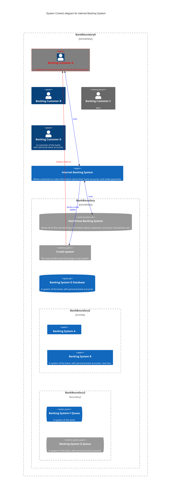
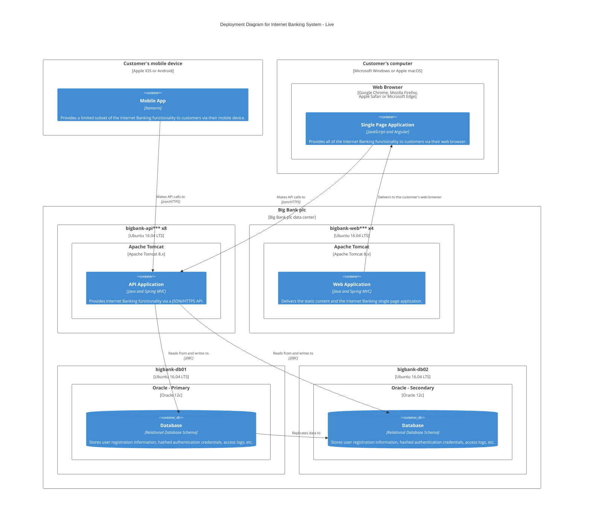
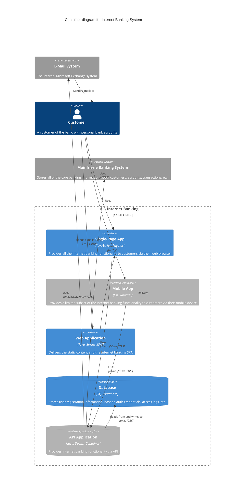
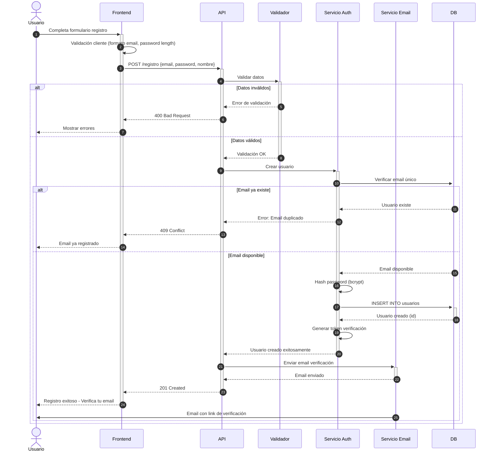

# Definición Arquitectura Proyecto {{project_name}}

**Fecha:** {{date}}  
**Versión:** 1.0  
**Autor:** {{user_name}}

---

## Introducción y Objetivos

### Resumen de Requisitos
<!--
Formato:
- 

EJEMPLO:
El desarrollo de este sistema está impulsado por la necesidad de automatizar el proceso de gestión de inventarios para reducir errores manuales y mejorar la eficiencia operativa. Además, se aspira a proporcionar reportes en tiempo real y facilitar la toma de decisiones estratégicas. Los principales requerimientos del sistema son los siguientes:

Permitir el registro y actualización de productos en el inventario.
Facilitar la consulta de stock disponible por categoría y ubicación.
Generar alertas automáticas cuando el stock esté por debajo del mínimo establecido.
Proporcionar reportes de movimientos de inventario.
Integrar con sistemas de punto de venta existentes.
Permitir la configuración de permisos por usuario y rol.
Generar códigos de barras para productos nuevos.
 -->

El desarrollo de este sistema está impulsado por la necesidad de [DESCRIBIR LA NECESIDAD PRINCIPAL O PROBLEMÁTICA QUE RESUELVE EL SISTEMA]. Además, se aspira a [OBJETIVOS ADICIONALES O BENEFICIOS ESPERADOS]. Los principales requerimientos del sistema son los siguientes:

- **[FUNCIONALIDAD 1]**: Descripción específica de la primera funcionalidad
- **[FUNCIONALIDAD 2]**: Descripción específica de la segunda funcionalidad  
- **[FUNCIONALIDAD 3]**: Descripción específica de la tercera funcionalidad
- **[FUNCIONALIDAD N]**: Continuar con las demás funcionalidades según sea necesario

{{resumen_requisitos}}

### Objetivos de Calidad
<!--
Formato:
- Realiza las adaptaciones correspondientes en la lista de acuerdo a las necesidades.

EJEMPLO:
Escalable: La arquitectura del sistema debe permitir el crecimiento en el número de usuarios concurrentes sin degradación del rendimiento. La escalabilidad es importante para soportar picos de demanda durante promociones especiales sin afectar la experiencia del usuario, lo que es fundamental dado el crecimiento proyectado de la base de usuarios.

Mantenible: Dado que el sistema requiere actualizaciones frecuentes de contenido y nuevas funcionalidades, es crucial que el código sea fácil de modificar y mantener. Esto incluye la capacidad de realizar cambios en la lógica de negocio, agregar nuevos módulos y corregir errores de manera eficiente sin afectar otras partes del sistema.

Seguro: El sistema debe proteger la información sensible de los usuarios mediante encriptación y controles de acceso adecuados. Esto es crucial para garantizar que los datos personales y transaccionales estén protegidos contra accesos no autorizados y cumplan con las regulaciones de protección de datos.

Disponible: Esto es vital para garantizar que el sistema esté operativo las 24 horas del día, los 7 días de la semana, permitiendo que los usuarios accedan a los servicios en cualquier momento sin interrupciones, lo cual es esencial para mantener la satisfacción del cliente.
 -->

- **[ATRIBUTO DE CALIDAD 1]**: [Descripción del atributo explicando por qué es importante para el sistema específico y cómo se relaciona con las funcionalidades principales. Incluir justificación técnica y beneficios para el usuario final.]

- **[ATRIBUTO DE CALIDAD 2]**: [Descripción del atributo explicando por qué es importante para el sistema específico y cómo se relaciona con las funcionalidades principales. Incluir justificación técnica y beneficios para el usuario final.]

- **[ATRIBUTO DE CALIDAD 3]**: [Descripción del atributo explicando por qué es importante para el sistema específico y cómo se relaciona con las funcionalidades principales. Incluir justificación técnica y beneficios para el usuario final.]

- **[ATRIBUTO DE CALIDAD N]**: [Continuar con los demás atributos según sea necesario]

{{objetivos_calidad}}

### Interesados
<!--
Formato:
- Realiza las adaptaciones correspondientes en la tabla de acuerdo a las necesidades.
-->

| **Nombre/Rol** | **Expectativas** |
| -------------- | ---------------- |

{{tabla_interesados}}

---

## Restricciones
<!--
Formato:
- Realiza las adaptaciones correspondientes en la tabla o la lista de acuerdo a las necesidades.

Nota: Selecciona una de las dos opciones para representar la información (lista o tabla).
-->

- **Plataforma de Despliegue:** La solución debe ser desplegada en Microsoft Azure, aprovechando sus servicios de infraestructura para asegurar escalabilidad, disponibilidad y seguridad. Esto implica que todas las configuraciones y desarrollos deben ser compatibles con el entorno y servicios específicos de Azure, como Azure Functions, Azure Blob Storage, Azure SQL Database, Azure App Service, Azure Kubernetes Service (AKS), entre otros.
- **Tecnología de Desarrollo:** El proyecto debe ser desarrollado utilizando Node.js versión 18 LTS o superior con TypeScript. Esto requiere que todos los componentes del software sean compatibles con esta versión y sigan las mejores prácticas de TypeScript para type safety.
- **Framework de Aplicación:** La solución debe emplear React 18+ junto con Next.js 14 para el desarrollo de la aplicación web. Esto significa que todas las interacciones de usuario y componentes de frontend deben ser implementados utilizando estos frameworks, aprovechando características como Server Components y App Router.
- **Arquitectura de Microservicios:** El sistema debe seguir una arquitectura de microservicios con comunicación mediante eventos usando Azure Service Bus o RabbitMQ. Cada servicio debe ser independiente, escalable y debe comunicarse a través de eventos asincrónicos o APIs REST según el caso de uso.
- **Autenticación y Autorización:** Se debe implementar autenticación mediante Azure Active Directory (Azure AD) con OAuth 2.0 y OpenID Connect. Todos los servicios deben validar tokens JWT y aplicar políticas de autorización basadas en roles (RBAC).
- **Base de Datos:** Se debe utilizar MongoDB como base de datos principal para documentos y Azure SQL Database para datos relacionales críticos. El diseño debe considerar una arquitectura polyglot persistence, donde cada microservicio puede tener su propia base de datos según sus necesidades específicas.

| **Tipo de Restricción** | **Descripción**              | **Justificación / Fuente** |
| ----------------------- | ---------------------------- | -------------------------- |
| Técnica                 | Uso obligatorio de Java 11   | Estándar corporativo       |
| Organizativa            | Ciclo de desarrollo Scrum    | Proceso organizacional     |
| Política                | Cumplimiento con GDPR        | Requisito legal            |
| Convención              | Guía de estilo de código XYZ | Mejora de mantenibilidad   |

{{restricciones}}

---

## Contexto y Alcance

### Contexto de Negocio
<!--
Formato: 
-Toma el siguiente diagrama como ejemplo y construye el diagrama correspondiente de acuerdo a las necesidades.
-->

<!--
Formato:
- Realiza las adaptaciones correspondientes en la tabla de acuerdo a las necesidades.
-->

| **Nombre del Socio de Comunicación** | **Entradas**                                      | **Salidas**                                           |
| ------------------------------------ | ------------------------------------------------- | ----------------------------------------------------- |
| Cliente                              | Solicitudes de servicios, consultas de productos  | Confirmaciones de pedidos, información solicitada     |
| Empleado                             | Datos de clientes, actualizaciones de operaciones | Estados de procesos, reportes operacionales           |
| Administrador del Sistema            | Configuraciones del sistema, gestión de usuarios  | Confirmaciones de cambios, logs del sistema           |
| Sistema de Facturación               | Confirmaciones de facturas procesadas             | Datos de transacciones, información de ventas         |
| Servicio de Notificaciones           | Confirmaciones de entrega de mensajes             | Solicitudes de envío de emails y SMS                  |
| Pasarela de Pagos                    | Confirmaciones de pago, estados de transacciones  | Solicitudes de procesamiento de pagos                 |
| Sistema de Inventario Legacy         | Actualizaciones de stock disponible               | Consultas de inventario, solicitudes de actualización |
| Plataforma de Analytics              | Reportes y dashboards generados                   | Datos de eventos, métricas de negocio                 |

{{contexto_negocio}}

### Contexto Técnico
<!--
Formato:
-Toma el siguiente diagrama como ejemplo y construye el diagrama correspondiente de acuerdo a las necesidades.
-->

<!--
Formato:
-Para cada componente agrega el nombre a la lista, describe la funcionalidad principal y responsabilidad dentro del sistema

Ejemplo:
-Load Balancer: Distribuye el tráfico entrante entre múltiples instancias de servidores para garantizar alta disponibilidad y rendimiento óptimo.
-Base de Datos Principal: Almacena información crítica del negocio incluyendo usuarios, productos, transacciones y configuraciones del sistema.
-->
 - **[Nombre Componente 1]:** Descripción de la funcionalidad principal y responsabilidad específica dentro del sistema.
 - **[Nombre Componente 2]:** Descripción de la funcionalidad principal y responsabilidad específica dentro del sistema.
 - **[Nombre Componente 3]:** Descripción de la funcionalidad principal y responsabilidad específica dentro del sistema.
 - **[Nombre Componente 4]:** Descripción de la funcionalidad principal y responsabilidad específica dentro del sistema.
 - **[Nombre Componente n]:** Descripción de la funcionalidad principal y responsabilidad específica dentro del sistema.

{{contexto_tecnico}}

---

## Estrategia de Solución
<!--
Formato:
-Para cada estrategia de solución agrega el nombre y una descripción clara siguiendo el formato establecido

Ejemplo:
La estrategia de solución se centra en la implementación de una arquitectura de microservicios escalable y resiliente utilizando contenedores en la nube. Esta solución busca modernizar los sistemas legacy existentes garantizando alta disponibilidad, seguridad robusta y experiencia de usuario optimizada. A continuación, se describen los elementos clave de la estrategia de solución:

Arquitectura Basada en Contenedores: La solución utiliza Docker y Kubernetes para crear un entorno de microservicios que permite despliegues independientes, escalabilidad automática y gestión eficiente de recursos. Esta aproximación facilita el mantenimiento, reduce el acoplamiento entre componentes y permite actualizaciones sin interrupciones del servicio.

Comunicación Asíncrona: Se implementará un patrón de mensajería basado en colas (RabbitMQ/Apache Kafka) para permitir comunicación no bloqueante entre servicios, mejorando la resiliencia del sistema y permitiendo procesamiento distribuido de cargas de trabajo.

Integración API-First: Todas las integraciones internas y externas seguirán un enfoque API-first utilizando REST y GraphQL, con un API Gateway centralizado que maneja autenticación, autorización, rate limiting y transformación de datos. Las integraciones con sistemas legacy se realizarán mediante adaptadores específicos.

Estrategia de Datos Híbrida: Se combinará almacenamiento relacional (PostgreSQL) para datos transaccionales con bases de datos NoSQL (MongoDB) para datos no estructurados, complementado con un data lake para analytics y un cache distribuido (Redis) para mejorar rendimiento.

Diseño Modular y Extensible: La arquitectura utiliza principios de Domain-Driven Design (DDD) para crear boundaries claros entre contextos de negocio. Esto facilita la evolución independiente de cada dominio y permite la incorporación de nuevas funcionalidades mediante el patrón de plugins.

Tecnología Full-Stack JavaScript: Se utiliza Node.js para backend y React para frontend, aprovechando la experiencia del equipo y el ecosistema maduro de librerías. TypeScript proporciona tipado estático para mejorar la calidad del código y facilitar el mantenimiento a largo plazo.
-->

La estrategia de solución se centra en la implementación de una arquitectura [TIPO DE ARQUITECTURA] utilizando [PLATAFORMA/TECNOLOGÍA PRINCIPAL]. Esta solución busca [OBJETIVO PRINCIPAL] garantizando [CARACTERÍSTICAS CLAVE DESEADAS]. A continuación, se describen los elementos clave de la estrategia de solución:

- **[Enfoque arquitectonico 1]:** Descripción del primer enfoque arquitectónico, sus beneficios y cómo contribuye a los objetivos del proyecto.
- **[Enfoque arquitectonico 2]:** Descripción del segundo enfoque arquitectónico, sus beneficios y cómo contribuye a los objetivos del proyecto.
- **[Estrategia de integración]:** Descripción de cómo se manejarán las integraciones internas y externas, incluyendo patrones y protocolos.
- **[Estrategia de datos]:** Descripción del enfoque para gestión, almacenamiento y procesamiento de datos.
- **[Capacidades de adaptación]:** Descripción de cómo la arquitectura soportará cambios futuros y escalabilidad.
- **[Justificación tecnología]:** Descripción de las tecnologías principales elegidas y por qué son adecuadas para el proyecto.

{{estrategia_solucion}}

---

## Vista Estática (Componentes)
<!--
Formato: 
-Toma el siguiente diagrama como ejemplo y construye el diagrama correspondiente de acuerdo a las necesidades.
-->

<!--
Formato: 
- Realiza las adaptaciones correspondientes en la tabla de acuerdo a las necesidades.
-->

| **Contenedor** | **Propósito/Responsabilidad** | **Interfaces** |
| -------------- | ----------------------------- | -------------- |

{{vista_estatica}}

---

## Vista Dinámica (Ejecución)
<!--
Formato: 
-Toma el siguiente diagrama como ejemplo y construye el diagrama correspondiente de acuerdo a las necesidades.
-->

{{vista_dinamica}}

---

## Vista de Despliegue
<!--
Formato:
-Toma el siguiente diagrama como ejemplo y construye el diagrama correspondiente de acuerdo a las necesidades.
-->

{{vista_despliegue}}

## Aspectos Transversales
<!--
Formato:
- La estructura de esta sección no es fija, de acuerdo a las necesidades se realizan propuestas de la estrucura y se valida con el usuario.
-->

{{aspectos_transversales}}

## Decisiones de Arquitectura
<!--
Formato:

-->

{{decisiones_arquitectura}}

## Requerimientos de Calidad

### Otros objetivos de Calidad
<!--
Formato:
- Realiza las adaptaciones correspondientes en la tabla de acuerdo a las necesidades.
-->

| **Objetivo de Calidad** | **Descripción** |
| ----------------------- | --------------- |

{{otros_objetivos_calidad}}

### Escenarios de Calidad
<!--
Formato:
- Realiza las adaptaciones correspondientes en la tabla de acuerdo a las necesidades.
-->

| **Escenario**            | **Identificador del escenario**                                             |
| ------------------------ | --------------------------------------------------------------------------- |
| **Fuente**               | Indique la persona, sistema o componente que inicia el estímulo.            |
| **Estímulo**             | Describa el evento que requiere una respuesta del sistema.                  |
| **Artefacto**            | Especifique la parte del sistema o el sistema completo involucrado.         |
| **Respuesta**            | Detalle la acción visible externamente que debe realizarse.                 |
| **Medida de Respuesta**  | Proporcione un criterio de éxito específico y medible para el escenario.    |
| **Entorno**              | Describa las circunstancias operativas bajo las cuales ocurre el escenario. |
| **Atributos de Calidad** | Enumerar los atributos de calidad relacionados con el escenario.            |

{{escenarios_calidad}}

## Riesgos y Deuda Técnica
<!--
Formato:
- Realiza las adaptaciones correspondientes en la tabla de acuerdo a las necesidades.
-->

| **Prioridad** | **Tipo**      | **Descripción**           | **Área Afectada**   | **Impacto**                       | **Probabilidad** | **Medidas Propuestas**                   | **Estado**                     |
| ------------- | ------------- | ------------------------- | ------------------- | --------------------------------- | ---------------- | ---------------------------------------- | ------------------------------ |
| Alta          | Riesgo        | [Descripción del riesgo]  | [Componente/Módulo] | [Descripción del impacto]         | Alta/Media/Baja  | [Acciones para evitar/mitigar/minimizar] | Pendiente/En progreso/Resuelto |
| Alta          | Deuda Técnica | [Descripción de la deuda] | [Componente/Módulo] | [Consecuencias si no se resuelve] | N/A              | [Plan de acción para reducir]            | Pendiente/En progreso/Resuelto |
| Media         | Riesgo        | [Descripción del riesgo]  | [Componente/Módulo] | [Descripción del impacto]         | Alta/Media/Baja  | [Acciones para evitar/mitigar/minimizar] | Pendiente/En progreso/Resuelto |

{{riesgos_deuda_tecnica}}

## Glosario
<!--
Formato:
- Realiza las adaptaciones correspondientes en la tabla de acuerdo a las necesidades.
-->

| **Término**              | **Definición**                                                                                                                                             |
| ------------------------ | ---------------------------------------------------------------------------------------------------------------------------------------------------------- |
| PHC                      | Plataforma de Historia Clínica                                                                                                                             |
| Consentimiento Informado | Proceso mediante el cual un paciente otorga permiso para un tratamiento médico después de ser informado de los riesgos y beneficios.                       |
| Phishing                 | Técnica de fraude en línea que intenta engañar a los usuarios para que revelen información confidencial, como contraseñas y números de tarjeta de crédito. |

{{glosario}}

## Notas de Implementación

- Este documento fue generado usando el workflow de Arquitectura Solución del Método Ceiba
- Para actualizaciones, ejecutar el workflow nuevamente con los datos actualizados
- Diagramas generados usando Mermaid para compatibilidad con herramientas de documentación

---

**Generado por:** Método Ceiba - Arquitectura Solución Workflow  
**Fecha de generación:** {{date}}
