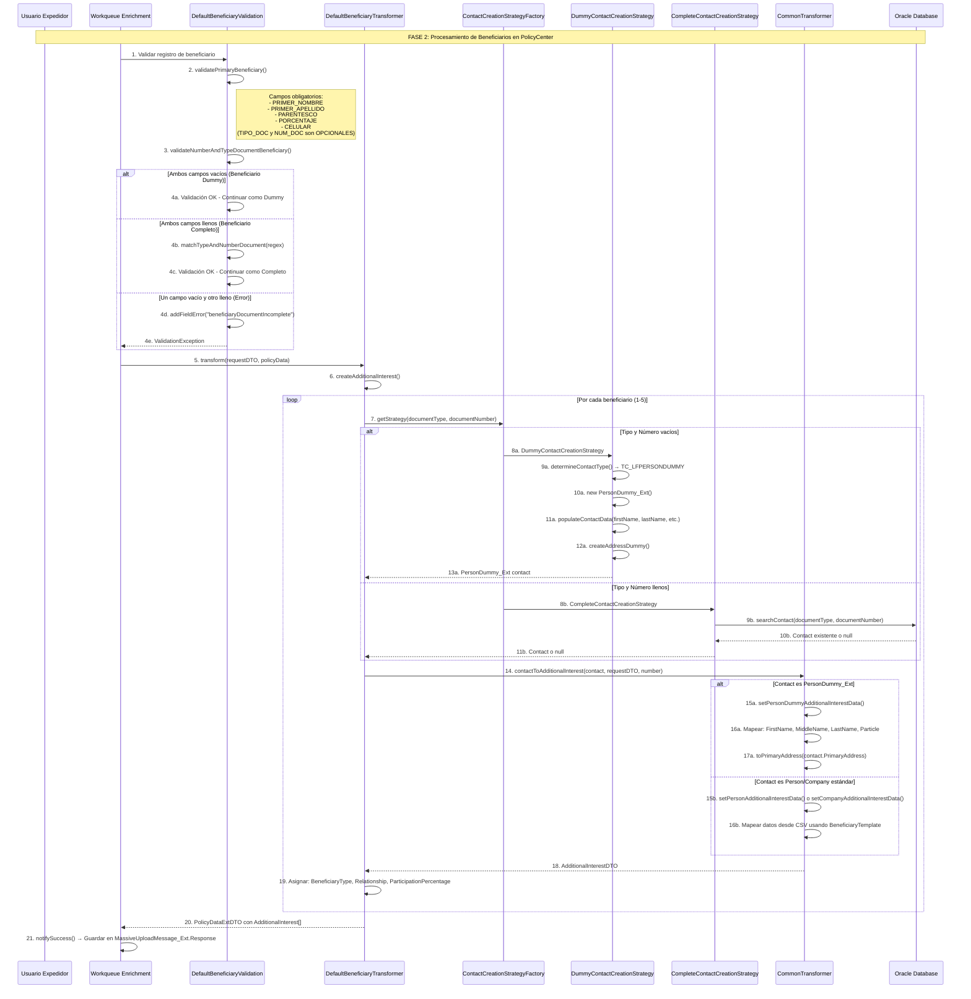
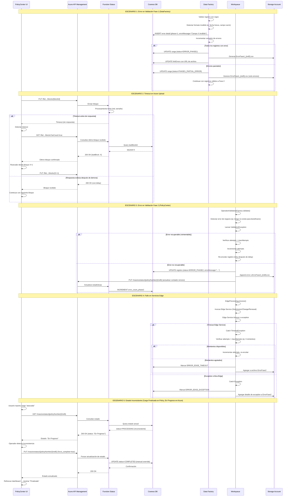
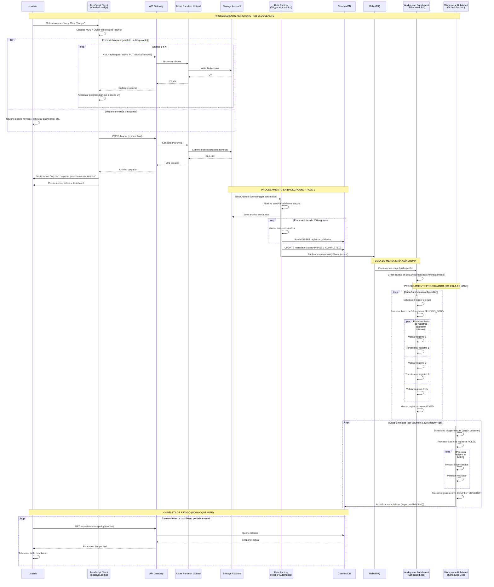
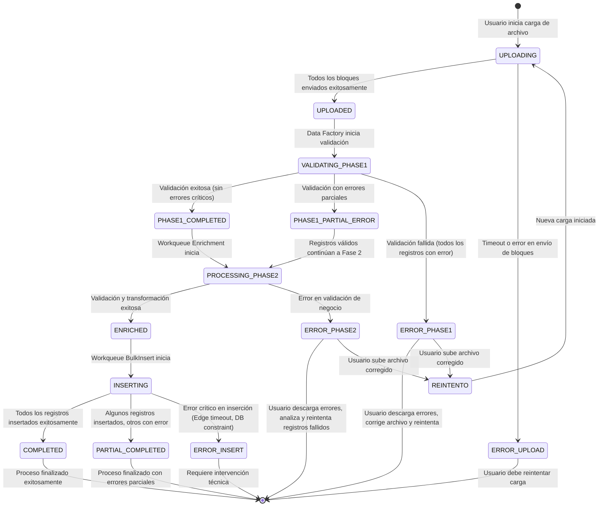
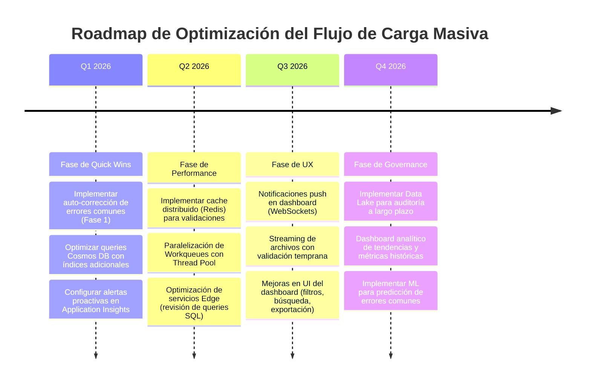

# Sistema Vida Grupo - Flujo: Carga Masiva de Riesgos y Beneficiarios 🔄

## 📋 **Introducción**

### Descripción del Flujo

La **Carga Masiva de Riesgos y Beneficiarios** es un proceso crítico de negocio que permite a los expedidores de pólizas de Vida Grupo cargar de forma masiva (batch) información de asegurados y sus beneficiarios para pólizas colectivas corporativas. Este flujo soporta operaciones de:

**Para Riesgos (Asegurados):**
- **Ingreso**: Creación de nuevos riesgos (asegurados) en una póliza master
- **Modificación**: Actualización de información de riesgos existentes
- **Cancelación**: Baja de riesgos de la póliza
- **Renovación**: Renovación de riesgos en procesos de renovación de póliza

**Para Beneficiarios:**
- **Modificación**: Creación/Actualización de beneficiarios para riesgos existentes
- **Beneficiarios Completos**: Con tipo y número de documento (se busca contacto existente)
- **Beneficiarios Dummy**: Sin identificación (solo nombres y datos básicos) - PersonDummy_Ext

El proceso está diseñado para manejar **volúmenes masivos** (desde cientos hasta miles de registros) de manera **completamente asíncrona**, dividido en **dos fases independientes**:

- **Fase 1 (Azure)**: Validación de estructura y formato del archivo mediante Azure Data Factory
- **Fase 2 (PolicyCenter)**: Validación de reglas de negocio, transformación e inserción de registros mediante Workqueues

Este diseño permite **procesamiento no bloqueante**, donde el usuario puede continuar trabajando mientras la carga se procesa en background, con visibilidad en tiempo real del estado mediante un dashboard interactivo.

### Scope del Documento

**Enfoque Principal**: Documentación técnica end-to-end del flujo de trabajo de Carga Masiva  
**Audiencia**: Desarrolladores, Arquitectos, Analistas de Negocio, DevOps  
**Última Actualización**: 28 de Enero, 2026

### Componentes Involucrados

| Componente         | Tecnología   | Puerto/Contexto   | Responsabilidad               |
| ------------------ | ------------ | ----------------- | ----------------------------- |
| **PolicyCenter** | Gosu + Java + Guidewire 8.0.7 | http://localhost:8080/pc | Sistema de registro de pólizas. Inicia carga, procesa Fase 2, gestiona UI del dashboard |
| **VidaGrupoIAC (Azure APIM)** | Azure API Management | https://api-vidagrupo-{env}-apigateway.azure-api.net | Gateway de APIs. Expone endpoints de Upload, Status, Download con autenticación y rate limiting |
| **Azure Function Upload** | Node.js/C# Serverless | https://{env}Upload.azurewebsites.net | Recepción de bloques de archivo, almacenamiento en Storage Account |
| **Azure Function Status** | Node.js/C# Serverless | https://{env}Status.azurewebsites.net | Consulta y actualización de estados de carga en Cosmos DB |
| **Azure Function Download** | Node.js/C# Serverless | https://{env}Download.azurewebsites.net | Generación y descarga de archivos de errores por fase |
| **Azure Data Factory** | PaaS Orchestration | N/A (servicio administrado) | Orquestación de pipelines de validación Fase 1 con expresiones regulares |
| **Cosmos DB** | NoSQL Database | N/A (servicio administrado) | Almacenamiento de registros de carga, errores de validación, metadatos |
| **Azure Storage Account** | Blob Storage | N/A (servicio administrado) | Almacenamiento de archivos originales y archivos de errores generados |
| **RabbitMQ** | Message Broker | msglab.suramericana.com.co:5672 | Mensajería asíncrona entre Azure y PolicyCenter para notificaciones de estado |

---

## 🔄 **Diagramas de Secuencia**

### 1. Flujo Principal: Carga Masiva End-to-End

```mermaid
sequenceDiagram
    participant U as Usuario Expedidor
    participant UI as PolicyCenter UI<br/>(PCF + JavaScript)
    participant APIM as Azure API Management
    participant FN_UP as Azure Function<br/>Massive Upload
    participant STORAGE as Azure Storage<br/>Blob Container
    participant DF as Azure Data Factory<br/>Pipeline Validation
    participant COSMOS as Cosmos DB<br/>MASSIVE_UPLOAD
    participant FN_ST as Azure Function<br/>Massive Status
    participant RMQ as RabbitMQ<br/>Messaging
    participant WQ1 as PolicyCenter<br/>Workqueue Enrichment
    participant WQ2 as PolicyCenter<br/>Workqueue BulkInsert
    participant EDGE as PolicyCenter<br/>Edge Services
    participant DB as PolicyCenter<br/>Oracle Database

    Note over U,DB: INICIO: Usuario carga archivo en PolicyCenter

    U->>UI: 1. Acceder a póliza master → Procesos Masivos
    UI->>UI: 2. Mostrar dashboard de historico (LifeCreateMassivelyInsuredsPopup.pcf)
    U->>UI: 3. Click en "Cargar" → Seleccionar archivo CSV/Excel
    UI->>UI: 4. JavaScript: Calcular MD5 del archivo
    UI->>APIM: 5. GET uploadInProcessExists(policyNumber)
    APIM->>FN_ST: 5.1. Consultar cargas activas
    FN_ST->>COSMOS: 5.2. Query cargas en proceso
    COSMOS-->>FN_ST: 5.3. Resultado (vacío o con carga)
    FN_ST-->>APIM: 5.4. 404 (sin carga) o 200 (carga activa)
    APIM-->>UI: 5.5. Respuesta validación

    alt Carga en proceso detectada
        UI->>U: 6. Error: "Póliza procesando otra carga"
    else Sin carga en proceso
        UI->>UI: 7. Dividir archivo en bloques de 64KB
        
        loop Por cada bloque
            UI->>APIM: 8. PUT /file/{codOffer}/{operation}/{typeFile}/{policyId}/{md5}/blocks/{blockId}
            APIM->>FN_UP: 8.1. Enviar bloque
            FN_UP->>STORAGE: 8.2. Almacenar bloque en blob
            STORAGE-->>FN_UP: 8.3. Confirmación
            FN_UP-->>APIM: 8.4. 200 OK
            APIM-->>UI: 8.5. Bloque enviado
            UI->>U: 8.6. Actualizar barra de progreso (X%)
        end

        UI->>APIM: 9. POST /file/{codOffer}/{operation}/{typeFile}/{policyId}/{md5}/blocks?blockCount=N
        APIM->>FN_UP: 9.1. Commit archivo
        FN_UP->>STORAGE: 9.2. Consolidar bloques en archivo único
        FN_UP->>COSMOS: 9.3. Crear registro de carga (status=UPLOADED)
        COSMOS-->>FN_UP: 9.4. Confirmación
        FN_UP-->>APIM: 9.5. 201 Created
        APIM-->>UI: 9.6. Archivo cargado
        UI->>U: 9.7. "Archivo cargado exitosamente (100%)"
    end

    Note over STORAGE,DF: FASE 1: Validación Azure Data Factory (Asíncrono)

    STORAGE->>DF: 10. Trigger: BlobCreated event
    DF->>DF: 11. Pipeline startFileValidation ejecuta
    DF->>STORAGE: 12. Leer archivo CSV/Excel
    STORAGE-->>DF: 13. Contenido del archivo
    
    loop Por cada registro del archivo
        DF->>DF: 14. Aplicar validaciones de formato (expresiones regulares)
        DF->>DF: 15. Validar estructura según controlSchema
        
        alt Registro válido
            DF->>COSMOS: 16. INSERT registro en container UPLOAD_DETAIL (status=VALIDATED)
        else Registro inválido
            DF->>COSMOS: 17. INSERT error en container UPLOAD_DETAIL (status=ERROR_PHASE1)
        end
    end

    alt Fase 1 exitosa (sin errores críticos)
        DF->>COSMOS: 18. UPDATE registro principal (status=PHASE1_COMPLETED)
        DF->>RMQ: 19. Publicar mensaje: NotifyPhaseStarted
        RMQ->>DB: 20. Insertar en NotifyPhaseMessage_Ext
        DF->>RMQ: 21. Publicar mensaje por registro: RecordReadyForProcessing
        
        loop Por cada registro válido
            RMQ->>WQ1: 22. Consumir mensaje de registro
            WQ1->>DB: 23. INSERT en MassiveUploadMessage_Ext (status=PENDING_SEND)
        end
    else Fase 1 con errores
        DF->>STORAGE: 24. Generar archivo ErrorFase1_{md5}.csv
        DF->>COSMOS: 25. UPDATE registro (status=ERROR_PHASE1, linkErrors=urlArchivo)
        DF->>RMQ: 26. Publicar NotifyPhaseError
    end

    Note over WQ1,DB: FASE 2: Procesamiento PolicyCenter (Asíncrono)

    WQ1->>WQ1: 27. Workqueue Enrichment inicia (scheduled)
    WQ1->>DB: 28. SELECT * FROM MassiveUploadMessage_Ext WHERE status=PENDING_SEND
    DB-->>WQ1: 29. Registros pendientes
    
    loop Por cada registro pendiente
        WQ1->>APIM: 30. GET /massivestatus/{policyNumber}/{md5}
        APIM->>FN_ST: 30.1. Consultar detalle
        FN_ST->>COSMOS: 30.2. Query registro completo
        COSMOS-->>FN_ST: 30.3. Datos del registro
        FN_ST-->>APIM: 30.4. 200 OK + JSON data
        APIM-->>WQ1: 30.5. Detalles del registro
        
        WQ1->>WQ1: 31. Validar campos de negocio (OperationValidationFactory)
        
        alt Validación exitosa
            WQ1->>WQ1: 32. Transformar datos (TransformerFactoryProducer)
            WQ1->>DB: 33. UPDATE MassiveUploadMessage_Ext (status=ACKED, response=transformedData)
            WQ1->>APIM: 34. PUT /massivestatus/{policyNumber}/{md5} (status=PROCESSING_PHASE2)
            APIM->>FN_ST: 34.1. Actualizar estado
            FN_ST->>COSMOS: 34.2. UPDATE estado
        else Validación fallida
            WQ1->>DB: 35. UPDATE MassiveUploadMessage_Ext (status=ERROR, errorMessage=...)
            WQ1->>APIM: 36. PUT /massivestatus/{policyNumber}/{md5} (status=ERROR_PHASE2)
            WQ1->>STORAGE: 37. Agregar error a archivo ErrorFase2_{md5}.csv
        end
    end

    Note over WQ2,EDGE: FASE 2: Bulk Insert según Volumen

    WQ2->>WQ2: 38. Workqueue BulkInsert inicia (por volumen: Low/Medium/High)
    WQ2->>DB: 39. SELECT * FROM MassiveUploadMessage_Ext WHERE status=ACKED
    DB-->>WQ2: 40. Registros listos para insertar
    
    loop Por cada registro ACKED
        WQ2->>EDGE: 41. Invocar Edge Service según operación
        
        alt Operación: Ingreso (Submission)
            EDGE->>DB: 42. Crear nueva póliza/riesgo (INSERT)
        else Operación: Modificación (PolicyChange)
            EDGE->>DB: 43. Actualizar riesgo existente (UPDATE)
        else Operación: Cancelación (Cancellation)
            EDGE->>DB: 44. Cancelar riesgo (UPDATE + estado)
        else Operación: Renovación (Renewal)
            EDGE->>DB: 45. Renovar riesgo (INSERT nueva versión)
        end
        
        DB-->>EDGE: 46. Resultado operación
        
        alt Inserción exitosa
            EDGE-->>WQ2: 47. Success
            WQ2->>DB: 48. UPDATE MassiveUploadMessage_Ext (status=COMPLETED)
            WQ2->>APIM: 49. Notificar éxito a Azure
            APIM->>FN_ST: 49.1. Actualizar contador
            FN_ST->>COSMOS: 49.2. INCREMENT successful_count
        else Inserción fallida
            EDGE-->>WQ2: 50. Error (timeout, constraint violation, etc.)
            WQ2->>DB: 51. UPDATE MassiveUploadMessage_Ext (status=ERROR)
            WQ2->>APIM: 52. Notificar error a Azure
            APIM->>FN_ST: 52.1. Actualizar contador
            FN_ST->>COSMOS: 52.2. INCREMENT error_count
        end
    end

    Note over U,DB: FINALIZACIÓN: Usuario consulta resultados

    U->>UI: 53. Click en "Refrescar Dashboard"
    UI->>APIM: 54. GET /massivestatus/{policyNumber}?page=1&size=10
    APIM->>FN_ST: 54.1. Listar cargas con paginación
    FN_ST->>COSMOS: 54.2. Query cargas ordenadas por fecha
    COSMOS-->>FN_ST: 54.3. Lista de cargas
    FN_ST-->>APIM: 54.4. 200 OK + JSON array
    APIM-->>UI: 54.5. Datos del dashboard
    UI->>U: 54.6. Mostrar tabla con MD5, fecha, estado, registros exitosos/fallidos

    alt Hay errores en alguna fase
        U->>UI: 55. Click en "Descargar Errores Fase X"
        UI->>APIM: 56. GET /massive-download/file/output-errors/...
        APIM->>FN_DOWN: 56.1. Solicitar archivo de errores
```

### 1.1. Flujo Específico: Carga Masiva de Beneficiarios



### Tabla de Decisión: Creación de Beneficiarios

| Tipo Documento | Número Documento | Estrategia | Resultado |
|----------------|------------------|------------|-----------|
| Vacío | Vacío | `DummyContactCreationStrategy` | Crea `PersonDummy_Ext` con datos básicos (nombres, dirección dummy) |
| Lleno | Lleno | `CompleteContactCreationStrategy` | Busca contacto existente en BD, si no existe usa datos del CSV |
| Vacío | Lleno | N/A | ❌ Error: "El tipo de documento y número de documento del beneficiario deben estar ambos diligenciados o ambos vacíos" |
| Lleno | Vacío | N/A | ❌ Error: "El tipo de documento y número de documento del beneficiario deben estar ambos diligenciados o ambos vacíos" |

### Arquitectura de Estrategias (Strategy Pattern)

```
┌─────────────────────────────────────────────────────────────────────────┐
│                    PATRÓN STRATEGY PARA BENEFICIARIOS                   │
├─────────────────────────────────────────────────────────────────────────┤
│                                                                         │
│  ContactCreationStrategyFactory                                         │
│  └── getStrategy(documentType, documentNumber)                          │
│      │                                                                  │
│      ├── if (ambos vacíos) ────────────► DummyContactCreationStrategy   │
│      │                                   ├── createContact()            │
│      │                                   │   └── new PersonDummy_Ext()  │
│      │                                   └── populateContactData()      │
│      │                                                                  │
│      ├── if (ambos llenos) ────────────► CompleteContactCreationStrategy│
│      │                                   ├── createContact()            │
│      │                                   │   └── searchContact()        │
│      │                                   └── return Contact o null      │
│      │                                                                  │
│      └── if (mixto) ───────────────────► DisplayableException           │
│                                          └── "Documento incompleto"     │
│                                                                         │
└─────────────────────────────────────────────────────────────────────────┘
```
        FN_DOWN->>STORAGE: 56.2. Leer ErrorFaseX_{md5}.csv
        STORAGE-->>FN_DOWN: 56.3. Contenido del archivo
        FN_DOWN-->>APIM: 56.4. 200 OK + CSV data
        APIM-->>UI: 56.5. Archivo CSV
        UI->>U: 56.6. Descargar ErrorFase1_{md5}.csv
    end
```

### 2. Flujo de Manejo de Errores



### 3. Flujo de Operaciones Asíncronas



---

## 🏗️ **Componentes de PolicyCenter para Beneficiarios**

### Estructura de Archivos

```
PolicyCenter/modules/configuration/gsrc/sura/pc/massiveupload/
├── batch/
│   └── enrichment/
│       └── EnrichmentProcessing.gs          # Orquestador principal de Fase 2
├── strategy/                                  # Patrón Strategy (NUEVO)
│   ├── ContactCreationStrategy.gs            # Interface del patrón
│   ├── ContactCreationStrategyFactory.gs     # Factory que decide estrategia
│   ├── DummyContactCreationStrategy.gs       # Crea PersonDummy_Ext
│   └── CompleteContactCreationStrategy.gs    # Busca contacto existente
├── transformer/
│   ├── DefaultBeneficiaryTransformer.gs      # Transformador de beneficiarios
│   ├── common/
│   │   └── CommonTransformer.gs              # Mapeo de contactos a DTOs
│   └── factories/
│       ├── TransformerFactoryProducer.gs     # Produce factories por tipo archivo
│       └── BeneficiaryTransformerFactory.gs  # Crea transformadores de beneficiarios
└── validations/
    ├── OperationValidationBase.gs            # Validaciones base
    └── factories/
        ├── OperationValidationFactory.gs     # Produce validadores por operación
        └── DefaultBeneficiaryValidation.gs   # Validaciones específicas beneficiarios
```

### Responsabilidades de Componentes

| Componente | Responsabilidad | Cambios para Dummy |
|------------|-----------------|-------------------|
| `EnrichmentProcessing` | Orquestador: valida → transforma → notifica | Sin cambios (genérico) |
| `OperationValidationFactory` | Crea validador según tipo archivo y operación | Limpieza código deprecado |
| `DefaultBeneficiaryValidation` | Valida campos obligatorios y formato de documento | TIPO_DOC y NUM_DOC ahora opcionales, validación condicional |
| `TransformerFactoryProducer` | Crea factory de transformadores según tipo archivo | Limpieza código deprecado |
| `DefaultBeneficiaryTransformer` | Transforma CSV a PolicyDataExtDTO con beneficiarios | Usa `ContactCreationStrategyFactory` |
| `ContactCreationStrategyFactory` | Decide qué estrategia usar según campos de documento | **NUEVO** - Implementa tabla de decisión |
| `DummyContactCreationStrategy` | Crea `PersonDummy_Ext` con datos básicos | **NUEVO** - Reutiliza lógica existente |
| `CompleteContactCreationStrategy` | Busca contacto existente por documento | **NUEVO** - Encapsula búsqueda |
| `CommonTransformer` | Mapea Contact a AdditionalInterestDTO | Soporte para `PersonDummy_Ext` |

### Entidades de Guidewire Utilizadas

| Entidad | Tipo | Propósito en Carga Masiva |
|---------|------|---------------------------|
| `MassiveUploadMessage_Ext` | Entity | Almacena registro CSV, estado, request/response de cada registro |
| `PersonDummy_Ext` | Entity (extiende Person) | Beneficiario persona sin identificación formal |
| `CompanyDummy_Ext` | Entity (extiende Company) | Beneficiario empresa sin identificación formal (no usado en beneficiarios) |
| `PolicyPeriod` | Entity (core) | Período de póliza donde se agregan beneficiarios |
| `Contact` | Entity (core) | Clase base para Person, Company, PersonDummy_Ext |

---

## 📊 **Estados y Transiciones**

### Diagrama de Estados del Flujo



---

## 📋 **Configuración y Parámetros**

### Configuración del Flujo

| Parámetro         | Valor         | Descripción             | Impacto si se Cambia |
| ----------------- | ------------- | ----------------------- | -------------------- |
| `BLOCK_SIZE` | `64 KB` | Tamaño de cada bloque para envío a Azure | Bloques más grandes: menos requests pero mayor riesgo de timeout. Bloques más pequeños: más requests pero más resiliente |
| `WORKQUEUE_BATCH_SIZE_ENRICHMENT` | `50 registros` | Cantidad de registros procesados por ejecución del Workqueue Enrichment | Valores altos: procesamiento más rápido pero mayor carga en DB. Valores bajos: procesamiento más lento pero menor impacto |
| `WORKQUEUE_SCHEDULE_ENRICHMENT` | `Cada 5 minutos` | Frecuencia de ejecución del Workqueue Enrichment | Menor frecuencia: procesamiento más lento. Mayor frecuencia: más carga en sistema |
| `WORKQUEUE_SCHEDULE_BULKINSERT_LOW` | `Cada 5 min (Lun-Vie 5-18h)` | Schedule para cargas pequeñas (0-100 registros) | Cambiar horario afecta ventana de procesamiento |
| `WORKQUEUE_SCHEDULE_BULKINSERT_MEDIUM` | `Cada 5 min (Lun-Vie 5-18h)` | Schedule para cargas medianas (101-2000 registros) | Cambiar horario afecta ventana de procesamiento |
| `WORKQUEUE_SCHEDULE_BULKINSERT_HIGH` | `Cada 5 min (Lun-Vie 5-18h)` | Schedule para cargas grandes (2001+ registros) | Cambiar horario afecta ventana de procesamiento |
| `MAX_RETRY_ATTEMPTS_ENRICHMENT` | `3 reintentos` | Número máximo de reintentos para validación/transformación | Más reintentos: mayor resiliencia pero registros problemáticos tardan más en marcar como error |
| `MAX_RETRY_ATTEMPTS_BULKINSERT` | `3 reintentos` | Número máximo de reintentos para inserción Edge | Más reintentos: mayor resiliencia para errores transitorios |
| `COSMOS_TTL_RECORDS` | `90 días` | Time To Live de registros en Cosmos DB | Mayor TTL: más almacenamiento. Menor TTL: pérdida de histórico |
| `PAGINATION_SIZE_DASHBOARD` | `10 cargas` | Cantidad de cargas mostradas por página en dashboard | Valores altos: más carga en renderizado UI. Valores bajos: más paginación |

### Message Queues Utilizadas

| Cola             | Exchange     | Routing Key     | TTL     | Propósito               |
| ---------------- | ------------ | --------------- | ------- | ----------------------- |
| `massive.upload.notify.phase` | `sura.seguros.massive` | `notify.phase.started` | `30 días` | Notificar inicio de fase desde Azure a PolicyCenter |
| `massive.upload.record.ready` | `sura.seguros.massive` | `record.ready.processing` | `30 días` | Notificar registro listo para Workqueue Enrichment |
| `massive.upload.status.update` | `sura.seguros.massive` | `status.update` | `7 días` | Actualizar estado de registro en Azure desde PolicyCenter (cola 44) |

---

## 🔧 **Métricas y Monitoreo**

### Puntos Críticos de Medición

| Métrica                    | Componente             | Umbral Esperado | Acción si se Excede    |
| -------------------------- | ---------------------- | --------------- | ---------------------- |
| **Tiempo de carga de archivo** | JavaScript + Azure Function Upload | < 2 minutos por cada 10MB | Revisar latencia de red, tamaño de bloques, concurrencia de requests |
| **Duración Fase 1 (DataFactory)** | Azure Data Factory | < 10 minutos por cada 1000 registros | Optimizar pipelines, aumentar paralelismo, revisar expresiones regulares |
| **Duración Fase 2 (Enrichment)** | Workqueue Enrichment | < 5 minutos por cada 100 registros | Optimizar validaciones, revisar queries a Cosmos/Oracle, aumentar batch size |
| **Duración Fase 2 (BulkInsert)** | Workqueue BulkInsert | < 10 minutos por cada 100 registros | Optimizar servicios Edge, revisar performance de DB, aumentar paralelismo |
| **Tasa de error Fase 1** | Data Factory | < 5% de registros con error | Revisar calidad de archivos fuente, mejorar documentación para usuarios |
| **Tasa de error Fase 2** | Workqueue Enrichment | < 2% de registros con error | Revisar validaciones de negocio, capacitar a usuarios en reglas |
| **Latencia API Massive Status** | Azure Function Status | < 500ms (p95) | Optimizar queries Cosmos DB, implementar cache, revisar índices |
| **Latencia API Massive Upload** | Azure Function Upload | < 1s por bloque (p95) | Revisar performance Storage Account, optimizar escritura de blobs |

### Logs Críticos a Monitorear

| Componente        | Archivo Log     | Patrón a Buscar       | Severidad |
| ----------------- | --------------- | --------------------- | --------- |
| **PolicyCenter Workqueue** | `PolicyCenter.log` | `ERROR.*MassiveUploadMessageProcess` | ERROR |
| **PolicyCenter Workqueue** | `PolicyCenter.log` | `ERROR.*EnrichmentProcessing` | ERROR |
| **PolicyCenter Workqueue** | `PolicyCenter.log` | `ERROR.*EdgeProcessing` | ERROR |
| **Azure Function Upload** | Application Insights | `exceptions` where `cloud_RoleName` contains "Upload" | ERROR |
| **Azure Function Status** | Application Insights | `exceptions` where `cloud_RoleName` contains "Status" | ERROR |
| **Azure Data Factory** | Monitor Logs | `Pipeline Run Failed` | ERROR |
| **RabbitMQ** | RabbitMQ Management | `Messages Unacked > 100` | WARN |
| **Cosmos DB** | Metrics | `429 Throttling Errors` | WARN |

---

## 🧪 **Escenarios de Prueba**

### Casos de Prueba Críticos

#### TC001: Flujo Exitoso Completo - Carga de Riesgos (Ingreso)

```gherkin
Scenario: Carga masiva exitosa de 100 riesgos nuevos en póliza Vida Grupo Integral
  Given el usuario es un expedidor autenticado en PolicyCenter
  And existe una póliza master de Vida Grupo Integral activa con número "VG-2025-001"
  And el usuario tiene un archivo CSV "riesgos_ingreso_100.csv" con 100 registros válidos
  And el archivo contiene: identificación, nombre, fecha nacimiento, suma asegurada, coberturas
  And no hay otra carga en proceso para la póliza "VG-2025-001"
  
  When el usuario navega a la póliza master "VG-2025-001"
  And hace click en "Procesos Masivos" → "Cargar Masivamente"
  And selecciona "Tipo de Archivo: Riesgo"
  And selecciona "Operación: Ingreso"
  And sube el archivo "riesgos_ingreso_100.csv"
  
  Then el sistema debe calcular el MD5 del archivo
  And debe enviar 100+ bloques de 64KB a Azure Massive Upload API
  And debe mostrar barra de progreso llegando al 100%
  And debe mostrar mensaje "Archivo cargado exitosamente"
  
  And dentro de 10 minutos, Azure Data Factory debe validar los 100 registros (Fase 1)
  And los 100 registros deben pasar las validaciones de formato
  And debe notificar a PolicyCenter vía RabbitMQ
  
  And el Workqueue Enrichment debe procesar los 100 registros (Fase 2 - Validación)
  And todos los registros deben pasar validaciones de negocio
  And debe transformar los datos según el template de Vida Grupo Integral
  
  And el Workqueue BulkInsert debe insertar los 100 riesgos en la póliza
  And debe invocar Edge Service "Submission" para cada riesgo
  And debe crear 100 certificados individuales en PolicyCenter
  
  And al refrescar el dashboard, debe mostrar:
    | Campo | Valor Esperado |
    | Estado | Finalizada |
    | Registros Cargados | 100 |
    | Exitosos | 100 |
    | Fallidos | 0 |
    | Fase | 2 |
```

#### TC002: Manejo de Error Crítico - Validación Fase 1

```gherkin
Scenario: Archivo con errores de formato es rechazado en Fase 1
  Given el usuario es un expedidor autenticado en PolicyCenter
  And existe una póliza master "VG-2025-002"
  And el usuario tiene un archivo CSV "riesgos_invalidos.csv" con 50 registros
  And 30 registros tienen fechas de nacimiento en formato incorrecto (DD/MM/YYYY en lugar de YYYY-MM-DD)
  And 10 registros tienen identificaciones con caracteres especiales inválidos
  And 10 registros son válidos
  
  When el usuario carga el archivo "riesgos_invalidos.csv"
  
  Then el archivo debe cargarse exitosamente a Azure Storage
  And Azure Data Factory debe ejecutar validaciones de formato
  And debe detectar 40 errores de formato (30 fechas + 10 identificaciones)
  And debe generar archivo "ErrorFase1_{md5}.csv" con detalle de los 40 errores
  And debe almacenar el archivo en Azure Storage
  And debe actualizar estado de la carga a "ERROR_PHASE1" en Cosmos DB
  
  And al refrescar el dashboard, debe mostrar:
    | Campo | Valor Esperado |
    | Estado | Error en Fase 1 |
    | Registros Cargados | 50 |
    | Exitosos Fase 1 | 10 |
    | Fallidos Fase 1 | 40 |
  
  And el usuario debe poder hacer click en "Descargar Errores Fase 1"
  And debe descargar archivo CSV con las 40 líneas con error y descripción del problema
  And debe mostrar mensajes como "Fecha inválida en columna 5", "Caracteres especiales no permitidos en identificación"
```

#### TC003: Timeout en Procesamiento

```gherkin
Scenario: Timeout en Edge Service requiere reintento automático
  Given hay una carga en Fase 2 con 20 registros en estado ACKED
  And el Workqueue BulkInsert está procesando los registros
  And el servicio Edge de PolicyCenter tiene alta latencia (> 30 segundos)
  
  When el Workqueue intenta insertar el registro #5
  And invoca el Edge Service "Submission"
  And el Edge Service no responde en 30 segundos (timeout)
  
  Then el Workqueue debe capturar TimeoutException
  And debe verificar que attempts < maxAttempts (3)
  And debe incrementar el contador de attempts a 1
  And debe re-encolar el registro #5 para reintentar en 5 minutos
  And debe continuar procesando el registro #6
  
  And en el segundo intento (5 minutos después)
  When el Edge Service sigue con timeout
  Then debe incrementar attempts a 2 y re-encolar
  
  And en el tercer intento
  When el Edge Service finalmente responde exitosamente
  Then debe marcar el registro como COMPLETED
  And debe actualizar estado en Azure a "Procesado"
```

---

## 🔍 **Troubleshooting**

### Problemas Comunes y Soluciones

#### Error: "La póliza máster está procesando otra carga y no ha finalizado"

**Causa**: Hay una carga previa en estado "En Progreso" que no ha finalizado (posiblemente atascada)

**Diagnóstico**:
```bash
# 1. Verificar cargas activas en Cosmos DB (Azure Portal)
# Navegar a: Cosmos DB → MASSIVE_UPLOAD → Container: MAIN_UPLOAD
# Query:
SELECT * FROM c WHERE c.policyNumber = "VG-2025-001" AND c.status IN ("PROCESSING_PHASE2", "VALIDATING_PHASE1")

# 2. Verificar en PolicyCenter Oracle DB
SELECT * FROM MassiveUploadMessage_Ext 
WHERE MasterPolicy = 'VG-2025-001' 
  AND Status IN ('PENDING_SEND', 'ACKED')
ORDER BY LastUpdate DESC;

# 3. Verificar estado de Workqueues
# En PolicyCenter Admin Console:
# Admin → Operations → WorkQueues → Buscar "MassiveUpload"
```

**Solución**: 
1. Si la carga realmente está procesando, esperar a que finalice
2. Si está atascada (sin cambios por > 1 hora):
   - Opción A: Actualizar estado manualmente en Cosmos DB a "COMPLETED"
   - Opción B: Usar API `PUT /massivestatus/{policyNumber}/{md5}` con `force_complete=true`
   - Opción C: Ejecutar script de limpieza en PolicyCenter

```sql
-- Script para marcar carga como completada manualmente
UPDATE MassiveUploadMessage_Ext 
SET Status = 'COMPLETED', LastUpdate = SYSDATE
WHERE LoadId = '{md5}' AND MasterPolicy = 'VG-2025-001';
COMMIT;
```

#### Error: "Archivo de errores no encontrado para Fase X"

**Causa**: El archivo de errores fue eliminado de Azure Storage o nunca se generó

**Diagnóstico**:
```bash
# Verificar en Azure Portal
# Storage Account → Containers → Buscar archivo "ErrorFase1_{md5}.csv"

# Verificar linkErrors en Cosmos DB
SELECT c.linkErrors FROM c WHERE c.md5 = "{md5}"
```

**Solución**: 
- Si el link existe pero el archivo no: Regenerar archivo de errores desde Cosmos DB
- Si no hay link: Verificar logs de Data Factory para ver si hubo errores al generar el archivo

#### Error: "Validation Exception: Riesgo no encontrado para beneficiario"

**Causa**: Carga de beneficiarios donde el riesgo asociado no existe en la póliza

**Diagnóstico**:
```bash
# En PolicyCenter Oracle
SELECT * FROM pc_policyrisk 
WHERE PolicyNumber = 'VG-2025-001' 
  AND TaxId = '123456789';
```

**Solución**: 
- Verificar que el archivo de beneficiarios use identificaciones de riesgos existentes
- Cargar primero los riesgos, luego los beneficiarios
- Revisar que la operación de beneficiarios sea "Modificación" (no "Ingreso")

### Comandos de Diagnóstico Útiles

```bash
# 1. Verificar estado de componentes Azure
# Azure CLI
az functionapp show --name {env}Upload --resource-group {rg} --query "state"
az functionapp show --name {env}Status --resource-group {rg} --query "state"

# Verificar logs de Azure Functions
az functionapp log tail --name {env}Upload --resource-group {rg}

# 2. Verificar Data Factory pipeline runs
az datafactory pipeline-run query-by-factory \
  --factory-name {dataFactoryName} \
  --resource-group {rg} \
  --last-updated-after "2025-11-25T00:00:00Z"

# 3. Revisar logs de PolicyCenter Workqueues
# En servidor PolicyCenter
tail -f /path/to/PolicyCenter/logs/PolicyCenter.log | grep "MassiveUpload"

# 4. Verificar RabbitMQ queues
# RabbitMQ Management UI: http://msglab.suramericana.com.co:15672
# Verificar:
# - Queue: massive.upload.notify.phase (messages ready, unacked)
# - Queue: massive.upload.record.ready (messages ready, unacked)

# 5. Verificar métricas de Cosmos DB
# Azure Portal → Cosmos DB → Metrics
# Métricas clave:
# - Total Requests
# - Throttled Requests (429 errors)
# - Server Side Latency
```

---

## 🚀 **Optimizaciones Futuras**

### Oportunidades de Mejora Identificadas

1. **Paralelización de Workqueues**
   - Actualmente: Procesamiento secuencial de registros en cada Workqueue
   - Mejora propuesta: Implementar procesamiento paralelo con Thread Pool
   - Beneficio esperado: Reducción de 40-60% en tiempo de Fase 2 para cargas grandes
   - Complejidad estimada: Media (requiere gestión de concurrencia y locks en DB)

2. **Cache de Validaciones**
   - Actualmente: Cada registro hace queries individuales a Cosmos/Oracle para validaciones
   - Mejora propuesta: Implementar cache distribuido (Redis) para catálogos, pólizas master, configuraciones
   - Beneficio esperado: Reducción de 30-50% en latencia de validaciones Fase 2
   - Complejidad estimada: Media (requiere infraestructura Redis + invalidación de cache)

3. **Streaming de Archivos (chunked upload)**
   - Actualmente: Archivo completo se sube antes de iniciar Fase 1
   - Mejora propuesta: Iniciar validación Fase 1 mientras se están subiendo bloques finales
   - Beneficio esperado: Reducción de 20-30% en tiempo total para archivos grandes (> 10MB)
   - Complejidad estimada: Alta (requiere cambios en DataFactory triggers y coordinación)

4. **Notificaciones Push en Dashboard**
   - Actualmente: Usuario debe refrescar manualmente el dashboard
   - Mejora propuesta: Implementar WebSockets o Server-Sent Events para actualización en tiempo real
   - Beneficio esperado: Mejor experiencia de usuario, visibilidad instantánea de cambios
   - Complejidad estimada: Media (requiere infraestructura WebSocket en PolicyCenter)

5. **Auto-corrección de Errores Comunes**
   - Actualmente: Todos los errores requieren intervención manual
   - Mejora propuesta: Implementar reglas de auto-corrección para errores comunes (ej: formato de fechas, trim de espacios)
   - Beneficio esperado: Reducción de 10-20% en tasa de error Fase 1
   - Complejidad estimada: Baja (lógica de transformación en DataFactory)

6. **Historización y Auditoría Mejorada**
   - Actualmente: TTL de 90 días en Cosmos DB, sin histórico detallado
   - Mejora propuesta: Implementar Data Lake para almacenamiento a largo plazo de auditoría
   - Beneficio esperado: Cumplimiento normativo, análisis de tendencias históricos
   - Complejidad estimada: Media (requiere pipeline ETL Cosmos → Data Lake)

### Roadmap de Evolución



---

## 📚 **Referencias**

- **GPS Arquitectónico**: [Arquitectura del Sistema - GPS Principal](./index.md)
- **Documentación de Componentes**:
  - [PolicyCenter - Arquitectura Detallada](./architecture-policycenter.md)
  - [VidaGrupoIAC - Infraestructura como Código](./architecture-VidaGrupoIAC.md)
  - [ADR-001: Refactorización Carga Masiva Beneficiarios Dummy](./adr-001-refactorizacion-carga-masiva-beneficiarios-dummy.md)
- **Historias de Usuario Relacionadas**:
  - [Historia #825041: Habilitar Creación de Beneficiarios Dummy por Carga Masiva](../stories/825041.habilitar-creacion-de-beneficiarios-dummy-por-carga-masiva-en-vida-grupo.story.md)
- **Configuración**: 
  - PolicyCenter: `./PolicyCenter/modules/configuration/config/web/pcf/`
  - VidaGrupoIAC: `./VidaGrupoIAC/modules/`
  - Azure Validations: `./VidaGrupoIAC/modules/datafactory/regex.csv`
- **Código Fuente**:
  - JavaScript Client: `./PolicyCenter/modules/configuration/deploy/resources/javascript/massiveLoad.js`
  - Workqueue Enrichment: `./PolicyCenter/modules/configuration/gsrc/sura/pc/massiveupload/batch/enrichment/EnrichmentProcessing.gs`
  - Workqueue Message Process: `./PolicyCenter/modules/configuration/gsrc/sura/pc/massiveupload/plugin/messaging/MassiveUploadMessageProcess.gs`
  - Edge Processing: `./PolicyCenter/modules/configuration/gsrc/sura/pc/massiveupload/batch/edge/EdgeProcessing.gs`
  - **Beneficiarios - Validación**: `./PolicyCenter/modules/configuration/gsrc/sura/pc/massiveupload/validations/factories/DefaultBeneficiaryValidation.gs`
  - **Beneficiarios - Transformación**: `./PolicyCenter/modules/configuration/gsrc/sura/pc/massiveupload/transformer/DefaultBeneficiaryTransformer.gs`
  - **Beneficiarios - Estrategias**: `./PolicyCenter/modules/configuration/gsrc/sura/pc/massiveupload/strategy/`
  - Data Factory Pipelines: `./VidaGrupoIAC/modules/datafactory/pipelines/`

---

## 📝 **Historial de Cambios**

| Versión | Fecha | Autor | Descripción |
|---------|-------|-------|-------------|
| 1.0 | 25-Nov-2025 | Arquitecto | Documentación inicial del flujo de carga masiva |
| 1.1 | 28-Ene-2026 | Developer | Agregado flujo específico de beneficiarios con soporte para Dummy (Historia #825041) |

---

_Documentación generada con Método Ceiba - Arquitecto_  
_Última actualización: 28 de Enero, 2026_  
_Versión: 1.1_
